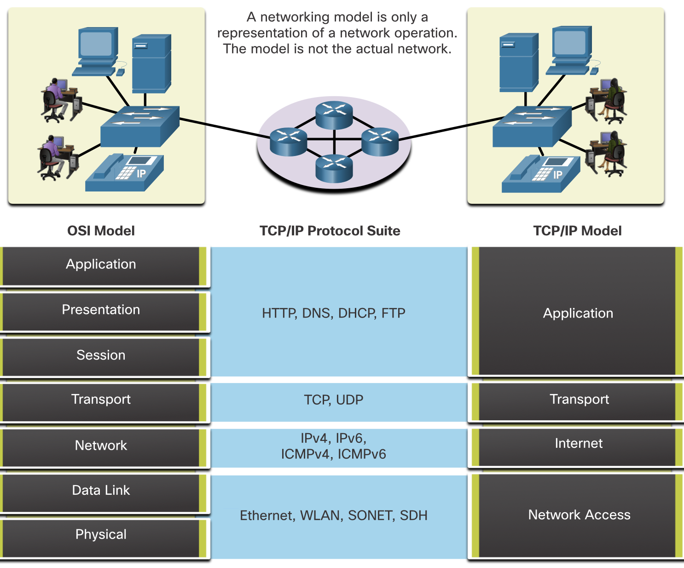
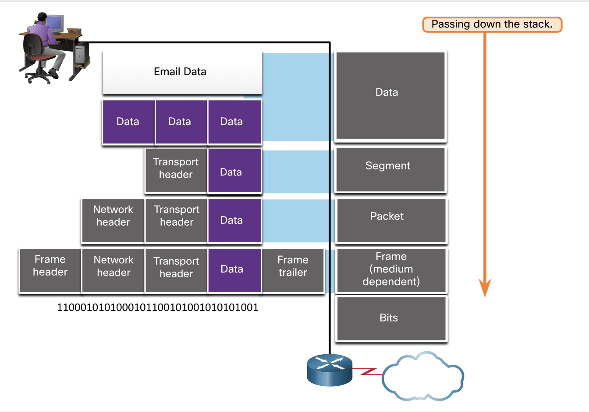

### 3 Introduction

Why should I take this module?
You know the basic components of a simple network, as well as initial configuration. But after you have configured and connected these components, how do you know they will work together? Protocols! Protocols are sets of agreed upon rules that have been created by standards organizations. But, because you cannot pick up a rule and look closely at it, how do you truly understand why there is such a rule and what it is supposed to do? Models! Models give you a way to visualize the rules and their place in your network. This module gives you an overview of network protocols and models. You are about to have a much deeper understanding of how networks actually work!

What will I learn to do in this module?
Topic Title| Topic Objective
The Rules | Describe the types of rules that are necessary to successfully communicate.
Protocols | Explain why protocols are necessary in network communication.
Protocol Suites | Explain the purpose of adhering to a protocol suite.
Standards Organizations | Explain the role of standards organizations in establishing protocols for network interoperability.
Reference Models |  Explain how the TCP/IP model and the OSI model are used to facilitate standardization in the communication process.
Data Encapsulation | Explain how data encapsulation allows data to be transported across the network.
Data Access | Explain how local hosts access local resources on a network.

### 3.1 The Rules

#### 3.1.2 Communication fundamentals 
Networks vary in size, shape, and function. They can be as complex as devices connected across the internet, or as simple as two computers directly connected to one another with a single cable, and anything in-between. However, simply having a wired or wireless physical connection between end devices is not enough to enable communication. For communication to occur, devices must know "how" to communicate.
People exchange ideas using many different communication methods. However, all communication methods have the following three elements in common:
• Message source (sender) - Message sources are people, or electronic devices, that need to send a message to other individuals or devices.
• Message Destination (receiver) - The destination receives the message and interprets it.
• Channel - This consists of the media that provides the pathway over which the message travels from source to destination.

#### 3.1.3 Communication Protocols 
Sending a message, whether by face-to-face communication or over a network, is governed by rules called protocols. These protocols are specific to the type of communication method being used. In our day-to-day personal communication, the rules we use to communicate over one medium, like a telephone call, are not necessarily the same as the rules for using another medium, such as sending a letter.
The process of sending a letter is similar to communication that occurs in computer networks.

#### 3.1.4 Rule Establishment 
Before communicating with one another, individuals must use established rules or agreements to govern the conversation. 

Protocols must account for the following requirements to successfully deliver a message that is understood by the receiver:
• An identified sender and receiver
• Common language and grammar
• Speed and timing of delivery
• Confirmation or acknowledgment requirements

#### 3.1.5 Network Protocol Requirements
The protocols that are used in network communications share many of these fundamental traits. In addition to identifying the source and destination, computer and network protocols define the details of how a message is transmitted across a network.
Common computer protocols include the following requirements:
• Message encoding
• Message formatting and encapsulation
• Message size
• Message timing
• Message delivery options

#### 3.1.6 Message Encoding
One of the first steps to sending a message is encoding. Encoding is the process of onverting information into another acceptable form, for transmission. Decoding reverses this process to interpret the information.

#### 3.1.7 Message Formatting and Encapsulation

When a message is sent from source to destination, it must use a specific format or structure. Message formats depend on the type of message and the channel that is used to deliver the message.

#### 3.1.8 Message Size

ANother rule of communication is message sieze

#### 3.1.9 Message Timing

Message timing is also very important in network communications. Message timing includes the following:
• Flow Control - This is the process of managing the rate of data transmission.
Flow control defines how much information can be sent and the speed at which it can be delivered. For example, if one person speaks too quickly, it may be difficult for the receiver to hear and understand the message. In network communication, there are network protocols used by the source and destination devices to negotiate and manage the flow of information.
• Response Timeout - If a person asks a question and does not hear a response within an acceptable amount of time, the person assumes that no answer is coming and reacts accordingly. The person may repeat the question or instead, may go on with the conversation. Hosts on the network use network protocols that specify how long to wait for responses and what action to take if a response timeout occurs.
• Access method - This determines when someone can send a message. Click Play in the figure to see an animation of two people talking at the same time, then a "collision of information" occurs, and it is necessary for the two to back off and start again. Likewise, when a device wants to transmit on a wireless LAN, it is necessary for the WLAN network interface card (NIC) to determine whether the wireless medium is available.

#### 3.1.10 Message Delivery Options

A message can be delivered in different ways.

#### 3.1.11 A note about the node icon
Networking documents and topologies often represent networking and end devices using a node icon. Nodes are typically represented as a circle. The figure shows a comparison of the three different delivery options using node icons instead of computer icons.

###### Quiz: 
What is the process of converting information into the proper form for transmission?
Formatting
Encoding
Encapsulation

Which step of the communication process is concerned with properly identifying the address of the sender and receiver?
Formatting
Course content
Encoding
Encapsulation

Which three are components of message timing? (Choose three.)
Flow control
Sequence numbers
Access method
Retransmit time
Response timeout

Which delivery method is used to transmit information to one or more end devices, but not all devices on the network?
Unicast
Multicast
Broadcast

### 3.2 Protocols

#### 3.2.1 Network Protocol Overview 
You know that for end devices to be able to communicate over a network, each device must abide by the same set of rules. These rules are called protocols and they have many functions in a network. This topic gives you a overview of network protocols.
Network protocols define a common format and set of rules for exchanging messages between devices. Protocols are implemented by end devices and intermediary devices in software, hardware, or both. Each network protocol has its own function, format, and rules for communications.
The table lists the various types of protocols that are needed to enable communications across one or more networks.

Network Communications Protocols :Protocols enable two or more devices to communicate over one or more networks. The Ethernet family of technologies involves a variety of protocols such as IP, Transmission Control Protocol (TCP), HyperText Transfer Protocol (HTTP), and many more.

Network Security Protocols :Protocols secure data to provide authentication, data integrity, and data encryption. Examples of secure protocols include Secure Shell (SSH), Secure Sockets Layer (SSL), and Transport Layer Security (TLS).

Routing Protocols: Protocols enable routers to exchange route information, compare path information, and then to select the best path to the destination network. Examples of routing protocols include Open Shortest Path First (OSPF) and Border Gateway Protocol (BGP).

Service Discovery Protocols: Protocols are used for the automatic detection of devices or services. Examples of service discovery protocols include Dynamic Host Configuration Protocol (DHCP) which discovers services for IP address allocation, and Domain Name System (DNS) which is used to perform name-to-IP address translation.

#### 3.2.2 Network Protocol Functions

Network communication protocols are responsible for a variety of functions necessary for network communications between end devices. For example, in the figure how does the computer send a message, across several network devices, to the server?

Addressing
This identifies the sender and the intended receiver of the message using a defined addressing scheme. Examples of protocols that provide addressing include Ethernet, IPv4, and IPv6.
Reliability
This function provides guaranteed delivery mechanisms in case messages are lost or corrupted in transit. TCP provides guaranteed delivery.
Flow control
This function ensures that data flows at an efficient rate between two communicating devices. TCP provides flow control services.
Sequencing
This function uniquely labels each transmitted segment of data.
The receiving device uses the sequencing information to reassemble the information correctly. This is useful if the data segments are lost, delayed or received out-of-order. TCP provides sequencing services.
Error Detection
This function is used to determine if data became corrupted during transmission. Various protocols that provide error detection include Ethernet, IPv4, IPv6, and TCP.
Application Interface
This function contains information used for process-to-process communications between network applications. For example, when accessing a web page, HTTP or HTTPS protocols are used to communicate between the client and server web processes.

#### 3.2.3 Protocol Interaction

A message sent over a computer network typically requires the use of several protocols, each one with its own functions and format. The figure shows some common network protocols that are used when a device sends a request to a web server for its web page.

Hypertext Transfer Protocol (HTTP) - This protocol governs the way a web server and a web client interact. HT TP defines the content and formatting of the requests and responses that are exchanged between the client and server. Both the client and the web server software implement HTTP as part of the application. HTTP relies on other protocols to govern how the messages are transported between the client and server.
• Transmission Control Protocol (TCP) - This protocol manages the individual conversations. TCP is responsible for guaranteeing the reliable delivery of the information and managing flow control between the end devices.
• Internet Protocol (IP) - This protocol is responsible for delivering messages from the sender to the receiver. IP is used by routers to forward the messages across multiple networks.
• Ethernet- This protocol is responsible for the delivery of messages from one NIC to another NIC on the same Ethernet local area network (LAN).

###### Quiz: 
BGP and OSPF are examples of which type of protocol?
Network communication
Network security
Routing
Service discovery

which two protocols are service discovery protocols? (Choose two.)
DNS
TCP
SSH
DHCP

What is the purpose of the sequencing function in network communication?
To uniquely label transmitted segments of data for proper reassembly by the receiver
To determine if data is corrupted during transmission
To ensure data flows at an efficient rate between sender and receiver
To guarantee delivery of data

This protocol is responsible for guaranteeing the reliable delivery of information.
TCP
HTTP
Ethernet

### 3.3 Protocols Suits
#### 3.3.1 Network Protocol Suites 
In many cases, protocols must be able to work with other protocols so that your online experience gives you everything you need for network communications. Protocol suites are designed to work with each other seamlessly.
A protocol suite is a group of inter-related protocols necessary to perform a communication function.
One of the best ways to visualize how the protocols within a suite interact is to view the interaction as a stack. A protocol stack shows how the individual protocols within a suite are implemented. The protocols are viewed in terms of layers, with each higher-level service depending on the functionality defined by the protocols shown in the lower levels. The lower layers of the stack are concerned with moving data over the network and providing services to the upper layers, which are focused on the content of the message being sent.
As illustrated in the figure, we can use layers to describe the activity occurring in face-to-face communication. At the bottom is the physical layer where we have two people with voices saying words out loud. In the middle is the rules layer that stipulates the requirements of communication including that a common language must be chosen. At the top is the content layer and this is where the content of the communication is actually spoken.
#### 3.3.2 Evolution of Protocol Suites 
A protocol suite is a set of protocols that work together to provide comprehensive network communication services. Since the 1970s there have been several different protocol suites, some developed by a standards organization and others developed by various vendors.
During the evolution of network communications and the internet there were several competing protocol suites, as shown in the figure.

[image]

• Internet Protocol Suite or TCP/IP - This is the most common and relevant protocol suite used today. The TCP/IP protocol suite is an open standard protocol suite maintained by the Internet Engineering Task Force (IETF).
• Open Systems Interconnection (OSI) protocols - This is a family of protocols developed jointly in 1977 by the International Organization for Standardization (ISO) and the International Telecommunications Union (ITU). The OSI protocol also included a seven-layer model called the OSI reference model. The OSI reference model categorizes the functions of its protocols. Today OSI is mainly known for its layered model.
The OSI protocols have largely been replaced by TCP/IP.
• AppleTalk - A short-lived proprietary protocol suite released by Apple Inc. in 1985 for Apple devices. In 1995, Apple adopted TCP/IP to replace Apple Talk.
• Novell NetWare - A short-lived proprietary protocol suite and network operating system developed by Novell Inc. in 1983 using the IPX
network protocol. In 1995, Novell adopted TCP/IP to replace IPX.

#### 3.3.3 TCP/IP Protocol Example

TCP/IP protocols are available for the application, transport, and internet layers. There are no TCP/IP protocols in the network access layer. The most common network access layer LAN protocols are Ethernet and WLAN (wireless LAN) protocols. Network access layer protocols are responsible for delivering the IP packet over the physical medium.
The figure shows an example of the three TCP/IP protocols used to send packets between the web browser of a host and the web server. HTTP, TCP, and IP are the TCP/IP protocols used. At the network access layer, Ethernet is used in the example.
However, this could also be a wireless standard such as WLAN or cellular service.

#### 3.3.4 TCP/IP Protocol Suite

Today, the TCP/IP protocol suite includes many protocols and continues to evolve to support new services. Some of the more popular ones are shown in the figure.

[image 2] 
TCP/IP is the protocol suite used by the internet and the networks of today. TCP/IP has two important aspects for vendors and manufacturers:
software.
• Open standard protocol suite - This means it is freely available to the public and can be used by any vendor on their hardware or in their

• Standards-based protocol suite - This means it has been endorsed by the networking industry and approved by a standards organization.

This ensures that products from different manufacturers can interoperate successfully.

###### Application layer
Name System
• DNS - Domain Name System. Translates domain names such as cisco.com, into IP addresses.
Host Config
• DHCPv4 - Dynamic Host Configuration Protocol for IPv4. A DHCPv4 server dynamically assigns IPv4 addressing information to DHCPv4 clients at start-up and allows the addresses to be re-used when no longer needed.
• DHCPv6 - Dynamic Host Configuration Protocol for IPv6. DHCPv6 is similar to DHCPv4. A DHCPv6 server dynamically assigns IPv6 addressing information to DHCPv6 clients at start-up.
• SLAAC - Stateless Address Autoconfiguration. A method that allows a device to obtain its IPv6 addressing information without using a DHCPv6 server.
Email
• SMTP - Simple Mail Transfer Protocol. Enables clients to send email to a mail server and enables servers to send email to other servers.
•РОР3 - Post Office Protocol version 3. Enables clients to retrieve email from a mail server and download the email to the client's local mail application.
• IMAP - Internet Message Access Protocol. Enables clients to access email stored on a mail server as well as maintaining email on the server.
File Transfer
• FTP - File Transfer Protocol. Sets the rules that enable a user on one host to access and transfer files to and from another host over a network. FTP is a reliable, connection-oriented, and acknowledged file delivery protocol.
• SFTP - SSH File Transfer Protocol. As an extension to Secure Shell (SSH) protocol, SFTP can be used to establish a secure file transfer session in which the file transfer is encrypted. SSH is a method for secure remote login that is typically used for accessing the command line of a device.
• TFTP - Trivial File Transfer Protocol. A simple, connectionless file transfer protocol with best-effort, unacknowledged file delivery. It uses less overhead than FTP.
Web and Web Service
• НТТР - Hypertext Transfer Protocol. A set of rules for exchanging text, graphic images, sound, video, and other multimedia files on the World Wide Web.
• HTTPS - HTTP Secure. A secure form of HTTP that encrypts the data that is exchanged over the World Wide Web.
• REST - Representational State Transfer. A web service that uses application programming interfaces (AP|s) and HTTP requests to create web applications.
###### Transport layer

Connection-Oriented
• TCP - Transmission Control Protocol. Enables reliable communication between processes running on separate hosts and provides reliable, acknowledged transmissions that confirm successful delivery.
Connectionless
• UDP - User Datagram Protocol. Enables a process running on one host to send packets to a process running on another host. However, UDP does not confirm successful datagram transmission.
###### Internet layer
Internet Layer
Internet Protocol
• IPv4 - Internet Protocol version 4. Receives message segments from the transport layer, packages messages into packets, and addresses packets for end-to-end delivery over a network. IPv4 uses a 32-bit address.
• IPv6 - IP version 6. Similar to IPv4 but uses a 128-bit address.
• NAT - Network Address Translation. Translates IPv4 addresses from a private network into globally unique public IPV4 addresses.
Messaging
• ICMPv4 - Internet Control Message Protocol for IPv4. Provides feedback from a destination host to a source host about errors in packet delivery.
• ICMPv6 - ICMP for IPv6. Similar functionality to ICMPv4 but is used for IPv6 packets.
• ICMPv6 ND - ICMPv6 Neighbor Discovery. Includes four protocol messages that are used for address resolution and duplicate address detection.
Routing Protocols
• OSPF - Open Shortest Path First. Link-state routing protocol that uses a hierarchical design based on areas. OSPF is an open standard interior routing protocol.
• EIGRP - EIGRP - Enhanced Interior Gateway Routing Protocol. An open standard routing protocol developed by Cisco that uses a composite metric based on bandwidth, delay, load and reliability.
• BGP - Border Gateway Protocol. An open standard exterior gateway routing protocol used between Internet Service Providers (ISPs). BGP is also commonly used between ISPs and their large private clients to exchange routing information.

###### Network Access layer
Address Resolution
• ARP - Address Resolution Protocol. Provides dynamic address mapping between an IPv4 address and a hardware address.
Note: You may see other documentation state that ARP operates at the Internet Layer (OSI Layer 3). However, in this course we state that ARP operates at the Network Access layer (OSI Layer 2) because it's primary purpose is the discover the MAC address of the destination. A MAC address is a Layer 2 address.
Data Link Protocols
• Ethernet - Defines the rules for wiring and signaling standards of the network access layer.
• WLAN - Wireless Local Area Network. Defines the rules for wireless signaling across the 2.4 GHz and 5 GHz radio frequencies.

#### 3.3.5 NTCP/IP Communication Process

 a web server encapsulating and sending a web page to a client.
de-encapsulating the web page for display in the web browser.

###### Quiz: 

UDP and TCP belong to which layer of the TCP/IP protocol?
Application
Transport
Internet
Network access

Which two protocols belong in the TCP/IP model application layer?
EIGRP
DNS
OSPF
ICMP
DHCP

Which protocol operates at the network access layer of the TCP/IP model?
HTTP
IP
DNS
Ethernet

Which of the following are protocols that provide feedback from the destination host to the source host regarding errors in packet delivery? (Choose two.)
IPv4
TCP
ICMPv4
<
IPv6
UDP
ICMPv6

A device receives a data link frame with data and processes and removes the Ethernet information. What information would be the next to be processed by the receiving device?
HTTP at the application layer
HTML at the application layer
IP at the internet layer
UDP at the internet layer
TCP at the transport layer

Which services are provided by the internet layer of the TCP/IP protocol suite? (Choose three.)
File Transfer
Address Resolution
Routing Protocols
Messaging
Ethernet
Internet Protocol
### 3.4 Standards Organisations 
#### 3.4.1 Open Standards 
When buying new tires for a car, there are many manufacturers you might choose. Each of them will have at least one type of tire that fits your car. That is because the automotive industry uses standards when they make cars. It is the same with protocols.
Because there are many different manufacturers of network components, they must all use the same standards. In networking, standards are developed by international standards organizations.
Open standards encourage interoperability, competition, and innovation. They also guarantee that the product of no single company can monopolize the market or have an unfair advantage over its competition.
A good example of this is when purchasing a wireless router for the home. There are many different choices available from a variety of vendors, all of which incorporate standard protocols such as IPV4, IPv6, DHCP, SLAAC, Ethernet, and 802.11 Wireless LAN. These open standards also allow a client running the Apple OS X operating system to download a web page from a web server running the Linux operating system. This is because both operating systems implement the open standard protocols, such as those in the TCP/IP protocol suite.
Standards organizations are usually vendor-neutral, non-profit organizations established to develop and promote the concept of open standards. These organizations are important in maintaining an open internet with freely accessible specifications and protocols that can be implemented by any vendor.
A standards organization may draft a set of rules entirely on its own or, in other cases, may select a proprietary protocol as the basis for the standard. If a proprietary protocol is used, it usually involves the vendor who created the protocol.
The figure shows the logo for each standards organization.
#### 3.4.2 Internet Standards
Various organizations have different responsibilities for promoting and creating standards for the internet and TCP/IP protocol.

Internet Society (ISOC) - Responsible for promoting the open development and evolution of internet use throughout the world.
• Internet Architecture Board (IAB) - Responsible for the overall management and development of internet standards.
• Internet Engineering Task Force (IETF) - Develops, updates, and maintains internet and TCP/IP technologies. This includes the process and documents for developing new protocols and updating existing protocols, which are known as Request for Comments (RFC) documents.
• Internet Research Task Force (IRTF) - Focused on long-term research related to internet and TCP/IP protocols such as Anti-Spam Research
Group (ASRG), Crypto Forum Research Group (CFRG), and Peer-to-Peer Research Group (P2PRG).

• Internet Corporation for Assigned Names and Numbers (ICANN) - Based in the United States, ICANN coordinates IP address allocation, the
management of domain names. and assianment of other information used in 7CP/IP protocols. management of domain names, and assignment of other information used in TCP/IP protocols.
• Internet Assigned Numbers Authority (IANA) - Responsible for overseeing and managing IP address allocation, domain name management,
and protocol identifiers for ICANN.
#### 3.4.3 Electronic and communications Standards 
Other standards organizations have responsibilities for promoting and creating the electronic and communication standards used to deliver the IP packets as electronic signals over a wired or wireless medium.
These standard organizations include the following:
• Institute of Electrical and Electronics Engineers(EEE, pronounced "I-triple-E") - Organization of electrical engineering and electronics dedicated to advancing technological innovation and creating standards in a wide area of industries including power and energy, healthcare, telecommunications, and networking. Important IEEE networking standards include
802.3 Ethernet and 802.11 WLAN standard. Search the internet for other IEEE network standards.
• Electronic Industries Alliance (EIA) - Organization is best known for its standards relating to electrical wiring, connectors, and the 19-inch racks used to mount networking equipment.
• Telecommunications Industry Association (TIA) - Organization responsible for developing communication standards in a variety of areas including radio equipment, cellular towers, Voice over IP (VolP) devices, satellite communications, and more.
• International Telecommunications Union-Telecommunication Standardization Sector (ITU-T) - One of the largest and oldest communication standards organizations. The ITU-T defines standards for video compression, Internet Protocol Television (IPTV), and broadband communications, such as a digital subscriber line (DSL).

###### Quiz: 
True or false. Standards organizations are usually vendor-neutral.
True
False

This standards organization is concerned with the Request for Comments (RFC) documents that specify new protocols and update existing ones.
Internet Society (ISOC)
Internet Engineering Task Force (IETF)
Internet Architecture Board (IAB)
Internet Research Task Force (IRTF)

This standards organization is responsible for IP address allocation and domain name management.
Internet Society (ISOC)
Internet Engineering Task Force (IETF)
Internet Architecture Board (IAB)
Internet Assigned Numbers Authority (IANA)

What types of standards are developed by the Electronics Industries Alliance (EIA)?
Electric wiring and connectors
Radio equipment and cell towers
Video compression and broadband communications
Voice over IP (VolP) and satellite communications

### 3.5 Reference Models
#### 3.5.1 The benefits of using a layered model
You cannot actually watch real packets travel across a real network, the way you can watch the components of a car being put together on an assembly line. so, it helps to have a way of thinking about a network so that you can imagine what is happening. A model is useful in these situations.
Complex concepts such as how a network operates can be difficult to explain and understand. For this reason, a layered model is used to modularize the operations of a network into manageable layers.
These are the benefits of using a layered model to describe network protocols and operations:
• Assisting in protocol design because protocols that operate at a specific layer have defined information that they act upon and a defined interface to the layers above and below
• Fostering competition because products from different vendors can work together
• Preventing technology or capability changes in one layer from affecting other layers above and below
• Providing a common language to describe networking functions and capabilities
As shown in the figure, there are two layered models that are used to describe network operations:
• Open System Interconnection (OSI) Reference Model
• TCP/IP Reference Model

#### 3.5.2 The OSI reference model
The OSI reference model provides an extensive list of functions and services that can occur at each layer. This type of model
not prescribing how it should be accomplished.
provides consistency within all types of network protocols and services by describing what must be done at a particular layer, but
It also describes the interaction of each layer with the layers directly above and below. The TCP/IP protocols discussed in this course are structured around both the OSI and TCP/IP models. The table shows details about each layer of the OSI model. The functionality of each layer and the relationship between layers will become more evident throughout this course as the protocols are discussed in more detail.

OSI Model
Layer
Description
7-
Application
The application layer contains protocols used for process-to-process communications.
6 -
Presentation
The presentation layer provides for common representation of the data transferred between application layer services.
5 - Session
The session layer provides services to the presentation layer to organize its dialogue and to manage data exchange.
4 - Transport
The transport layer defines services to segment, transfer, and reassemble the data for individual communications between the end devices.
3 - Network
The network layer provides services to exchange the individual pieces of data over the network between identified end devices.
2 - Data Link
The data link layer protocols describe methods for exchanging data frames between devices over a common media
1 - Physical
The physical layer protocols describe the mechanical, electrical, functional, and procedural means to ctivate, maintain, and de-activate physical connections for a bit transmission to and from a network device.

Note: Whereas the TCP/IP model layers are referred to only by name, the seven OSl model layers are more often referred to by number rather than by name. For instance, the physical layer is referred to as Layer 1 of the OSI model, data link layer is Layer2,
and so on.
#### 3.5.3 TCP/IP Protocol Model

The TCP/IP protocol model for internetwork communications was created in the early 1970s and is sometimes referred to as the internet model. This type of model closely matches the structure of a particular protocol suite. The TCP/IP model is a protocol model because it describes the functions that occur at each layer of protocols within the TCP/IP suite. TCP/IP is also used as a reference model. The table shows details about each layer of the TCP/IP model.

4-Application: represent data to user, plus encoding and dialog control
3-Transport : supports communication between various devices accros diverse networks 
2-Internet: determines the best path through the network
1-Network access: controls the hardware deiveces and media that make up the network 

The definitions of the standard and the TCP/IP protocols are discussed in a public forum and defined in a publicly available set of IETF RFCs. An RFC is authored by networking engineers and sent to other IETF members for comments.
#### 3.5.4 OSI and TCP/IP model comparison
The protocols that make up the TCP/IP protocol suite can also be described in terms of the OSI reference model. In the OSI model, the network access layer and the application layer of the TCP/IP model are further divided to describe discrete functions that must occur at these layers.

At the network access layer, the TCP/IP protocol suite does not specify which protocols to use when transmitting over a physical medium; it only describes the handoff from the internet layer to the physical network protocols. OSI Layers 1 and 2 discuss the necessary procedures to access the media and the physical means to send data over a network.

The key similarities are in the transport and network layers; however, the two models differ in how they relate to the layers above and below each layer:

OSI Layer 3, the network layer, maps directly to the TCP/IP internet layer. This layer is used to describe protocols that address and route messages through an internetwork.
OSI Layer 4, the transport layer, maps directly to the TCP/IP transport layer. This layer describes general services and functions that provide ordered and reliable delivery of data between source and destination hosts.
The TCP/IP application layer includes several protocols that provide specific functionality to a variety of end user applications. The OSI model Layers 5, 6, and 7 are used as references for application software developers and vendors to produce applications that operate on networks.
Both the TCP/IP and OSI models are commonly used when referring to protocols at various layers. Because the OSI model separates the data link layer from the physical layer, it is commonly used when referring to these lower layers.

### 3.6 Data Encapsulation
#### 3.6.1 Segmenting Messages
Knowing the OSI reference model and the TCP/IP protocol model will come in handy when you learn about how data is encapsulated as it moves across a network. It is not as simple as a physical letter being sent through the mail system.
In theory, a single communication, such as a video or an email message with many large attachments, could be sent across a network from a source to a destination as one massive, uninterrupted stream of bits. However, this would create problems for other devices needing to use the same communication channels or links. These large streams of data would result in significant delays. Further, if any link in the interconnected network infrastructure failed during the transmission, the complete message would be lost and would have to be retransmitted in full.
A better approach is to divide the data into smaller, more manageable pieces to send over the network. Segmentation is the process of dividing a stream of data into smaller units for transmissions over the network. Segmentation is necessary because data networks use the TCP/IP protocol suite send data in individual IP packets. Each packet is sent separately, similar to sending a long letter as a series of individual postcards. Packets containing segments for the same destination can be sent over different paths.
This leads to segmenting messages having two primary benefits:
• Increases speed - Because a large data stream is segmented into packets, large amounts of data can be sent over the network without tying up a communications link. This allows many different conversations to be interleaved on the network called multiplexing.
• Increases efficiency -If a single segment is fails to reach its destination due to a failure in the network or network congestion, only that segment needs to be retransmitted instead of resending the entire data stream.

#### 3.6.2 Sequencing

The challenge to using segmentation and multiplexing to transmit messages across a network is the level of complexity that is added to the process. Imagine if you had to send a 100-page letter, but each envelope could only hold one page. Therefore, 100 envelopes would be required and each envelope would need to be addressed individually. It is possible that the 100-page letter in 100 different envelopes arrives out-of-order. Consequently, the information in the envelope would need to include a sequence number to ensure that the receiver could reassemble the pages in the proper order.
In network communications, each segment of the message must go through a similar process to ensure that it gets to the correct destination and can be reassembled into the content of the original message, as shown in the figure. TCP is responsible for sequencing the individual segments.
#### 3.6.3 Protocol data units
As application data is passed down the protocol stack on its way to be transmitted across the network media, various protocol information is added at each level. This is known as the encapsulation process.
Note: Although the UDP PDU is called datagram, IP packets are sometimes also referred to as IP datagrams.
The form that a piece of data takes at any layer is called a protocol data unit (PDU). During encapsulation, each succeeding layer encapsulates the PDU that it receives from the layer above in accordance with the protocol being used. At each stage of the process, a PDU has a different name to reflect its new functions. Although there is no universal naming convention for PDUs, in this course, the PDUs are named according to the protocols of the TCP/IP suite. The PDUs for each form of data are shown in the figure.

• Data - The general term for the PDU used at the application layer
• Segment - Transport layer PDU
• Packet - Network layer PDU
• Frame - Data Link layer PDU
• Bits - Physical layer PDU used when physically transmitting data over the medium
Note: If the Transport header is TCP, then it is a segment. If the Transport header is UDP then it is a datagram.

#### 3.6.4 Encapsulation 
When messages are being sent on a network, the encapsulation process works from top to bottom. At each layer, the upper layer information is considered data within the encapsulated protocol. For example, the TCP segment is considered data within the IP packet.
#### 3.6.5 De-capsulation
This process is reversed at the receiving host and is known as de-encapsulation. De-encapsulation is the process used by a receiving device to remove one or more of the protocol headers. The data is de-encapsulated as it moves up the stack toward the end-user application.
###### Quiz: 

What is the process of dividing a large data stream into smaller pieces prior to transmission?
Sequencing
Duplexing
Multiplexing
Segmentation

What is the PDU associated with the transport layer?
Segment
Packet
Bits
Frame

Which protocol stack layer encapsulates data into frames?
Data link
Transport
Network
Application

What is the name of the process of adding protocol information to data as it moves down the protocol stack?
De-encapsulation
Sequencing
Segmentation
Encapsulation

### 3.7 Data Access
#### 3.7.1 Addresses
As you just learned, it is necessary to segment messages in a network. But those segmented messages will not go anywhere if they are not addressed properly. This topic gives an overview of network addresses. You will also get the chance to use the Wireshark tool, which will help you to 'view' network traffic.
The network and data link layers are responsible for delivering the data from the source device to the destination device. As shown in the figure, protocols at both layers contain a source and destination address, but their addresses have different purposes.
• Network layer source and destination addresses - Responsible for delivering the IP packet from the original source to the final destination, which may be on the same network or a remote network.
• Data link layer source and destination addresses - Responsible for delivering the data link frame from one network
interface card (NIC) to another NIC on the same network.

Physical: Timing and synchronization bits
Data Link :Destination and source physical addresses
Network: Destination and source logical network addresses
Transport: Destination and source process number (ports)
Upper Layers: Encoded application data
#### 3.7.2 Layer 3 Logical Address

An IP address is the network layer, or Layer 3, logical address used to deliver the IP packet from the original source to the final destination.
The IP packet contains two IP addresses:
• Source IP address - The IP address of the sending device, which is the original source of the packet.
Jestination IP address - The IP address of the receiving device, which is the final destination of the packet.
The IP addresses indicate the original source IP address and final destination IP address. This is true whether the source and destination are on the same IP network or different IP networks.
An IP address contains two parts:
• Network portion (IPv4) or Prefix (IPv6) - The left-most part of the address that indicates the network in which the IP address is a member. All devices on the same network will have the same network portion of the address.
• Host portion (IPv4) or Interface ID (IPv6) - The remaining part of the address that identifies a specific device on the network. This portion is unique for each device or interface on the network.
Note: The subnet mask (IPv4) or prefix-length ((Pv6) is used to identify the network portion of an IP address from the host portion.

#### 3.7.3 Devices on the same network
In this example we have a client computer, PC1, communicating with an FTP server on the same IP network.
• Source IPv4 address - The IPv4 address of the sending device, the client computer PC1: 192.168.1.110.
Destination IPv4 address - The IPv4 address of the receiving device. FTP server: 192.168.1.9.
Notice in the figure that the network portion of the source IPv4 address and the network portion of the destination IPv4 address are the same and therefore; the source and destination are on the same network.

MAC addresses are physically embedded on the Ethernet NIC.
• Source MAC address - This is the data link address, or the Ethernet MAC address, of the device that sends the data link frame with the encapsulated IP packet. The MAC address of the Ethernet NIC of PC1 is AA-AA-AA-AA-AA-AA, written in hexadecimal notation.
• Destination MAC address - When the receiving device is on the same network as the sending device, this is the data link address of the receiving device. In this example, the destination MAC address is the MAC address of the FTP server: CC-
CC-CC-Cc-Cc-CC, written in hexadecimal notation.
The frame with the encapsulated IP packet can now be transmitted from PC1 directly to the FTP server.

#### 3.7.4 Role of the datalink layer addresses - same IP network
When the sender and receiver of the IP packet are on the same network, the data link frame is sent directly to the receiving device. On an Ethernet network, the data link addresses are known as Ethernet Media Access Control (MAC) addresses, as highlighted in the figure.
#### 3.7.5 Devices on a remote network
But what are the roles of the network layer address and the data link layer address when a device is communicating with a device on a remote network? In this example we have a client computer, PC1, communicating with a server, named Web Server, on a different IP network.
#### 3.7.6 Role of the network layer addresses 
When the sender of the packet is on a different network from the receiver, the source and destination IP addresses will represent hosts on different networks. This will be indicated by the network portion of the IP address of the destination host.
• Source IPv4 address - The IPv4 address of the sending device, the client computer PC1: 192.168.1.110. estination IPv4 address - The IPv4 address of the receiving device, the server, Web Server: 172.16.1.99.
Notice in the figure that the network portion of the source IPv4 address and destination IPv4 address are on different networks.
#### 3.7.7 Role of the sata link layer addreses- different IP Network
When the sender and receiver of the IP packet are on different networks, the Ethernet data link frame cannot be sent directly to the destination host because the host is not directly reachable in the network of the sender. The Ethernet frame must be sent to another device known as the router or default gateway. In our example, the default gateway is R1. R1 has an Ethernet data link address that is on the same network as PC1. This allows PC1 to reach the router directly.
• Source MAC address - The Ethernet MAC address of the sending device, PC1. The MAC address of the Ethernet interface of PC1 is AA-AA-AA-AA-AA-AA.
• Destination MAC address - When the receiving device, the destination IP address, is on a different network from the sending device, the sending device uses the Ethernet MAC address of the default gateway or router. In this example, the destination MAC address is the MAC address of the R1 Ethernet interface, 11-11-11-11-11-11. This is the interface that is attached to the same network as PC1, as shown in the figure.
The Ethernet frame with the encapsulated IP packet can now be transmitted to R1. R1 forwards the packet to the destination, Web Server. This may mean that R1 forwards the packet to another router or directly to Web Server if the destination is on a network connected to R1.
It is important that the IP address of the default gateway be configured on each host on the local network. All packets to a destination on remote networks are sent to the default gateway. Ethernet MAC addresses and the default gateway are discussed in more detail in other modules.
#### 3.7.8 Data link Addresses  
The data link Layer 2 physical address has a different role. The purpose of the data link address is to deliver the data link frame from one network interface to another network interface on the same network.
Before an IP packet can be sent over a wired or wireless network, it must be encapsulated in a data link frame, so it can be transmitted over the physical medium.

As the IP packet travels from host-to-router, router-to-router, and finally router-to-host, at each point along the way the IP packet is ncapsulated in a new data link frame. Each data link frame contains the source data link address of the NIC card sending the frame, and the destination data link address of the NIC card receiving the frame.
The Layer 2, data link protocol is only used to deliver the packet from NIC-to-NIC on the same network. The router removes the Layer 2 information as it is received on one NIC and adds new data link information before forwarding out the exit NIC on its way towards the final destination.
The IP packet is encapsulated in a data link frame that contains the following data link information:
• Source data link address - The physical address of the NIC that is sending the data link frame.
• Destination data link address - The physical address of the NIC that is receiving the data link frame. This address is either the next hop router or the address of the final destination device.

###### Quiz: 

True or false? Frames exchanged between devices in different IP networks must be forwarded to a default gateway.
True
False

True or false? The right-most part of an IP address is used to identify the network that a device belongs to.

What is used to determine the network portion of an IPv4 address?
Subnet mask
MAC address
Right-most part of the IP address
Left-most part of the MAC address

Which of the following statements are true regarding network layer and data link layer addresses? (Choose three.)
Data link layer addresses are logical and network layer addresses are physical.
Network layer addresses are expressed as 12 hexadecimal digits and data link layer addresses are decima
Network layer addresses are logical and data link addresses are expressed as 12 hexadecimal digits.
Data link layer addresses are physical and network layer addresses are logical.
Network layer addresses are either 32 or 128 bits in length.
Data link layer addresses are 32 bits in length.

What is the order of the two addresses in the data link frame?
Source MAC, destination MAC
Destination MAC, source IP
Destination IP, source IP
Destination MAC, source MAC
Source IP, destination IP

True or False? Data Link addresses are physical so they never change in the data link frame from source to destination.
True
False

What did I learn  
The Rules
All communication methods have three elements in common: message source (sender), message destination (receiver), and channel. Sending a message is governed by rules called protocols. Protocols must include: an identified sender and receiver, common language and grammar, speed and timing of delivery, and confirmation or acknowledgment requirements. Common computer protocols include these requirements: message encoding, formatting and encapsulation, size, timing, and delivery options. Encoding is the process of converting information into another acceptable form, for transmission. Decoding reverses this process to interpret the information. Message formats depend on the type of message and the channel that is used to deliver the message. Message timing includes flow control, response timeout, and access method. Message delivery options include unicast, multicast, and broadcast.
Protocols
Protocols are implemented by end-devices and intermediary devices in software, hardware, or both. A message sent over a computer network typically requires the use of several protocols, each one with its own functions and format. Each network protocol has its own function, format, and rules for communications. The Ethernet family of protocols includes IP, TCP, HTTP, and many more. Protocols secure data to provide authentication, data integrity, and data encryption: SSH, SSL, and TLS. Protocols enable routers to exchange route information, compare path information, and then to select the best path to the destination network: OSPF and BGP. Protocols are used for the automatic detection of devices or services: DHCP and DNS. Computers and network devices use agreed-upon protocols that provide the following functions: addressing, reliability, flow control, sequencing, error-detection, and application interface.
Protocol Suites
A protocol suite is a group of inter-related protocols necessary to perform a communication function. A protocol stack shows how the individual protocols within a suite are implemented. Since the 1970s there have been several different protocol suites, some developed by a standards organization and others developed by various vendors. TCP/IP protocols are available for the application, transport, and internet layers. TCP/IP is the protocol suite used by today's networks and internet. TCP/IP offers two important aspects to vendors and manufacturers: open standard protocol suite, and standards-based protocol suite. The TCP/IP protocol suite communication process enables such processes as a web server encapsulating and sending a web page to a client, as well as the client de-encapsulating the web page for display in a web browser.
Standards Organizations
Open standards encourage interoperability, competition, and innovation. Standards organizations are usually vendor-neutral, nonprofit organizations established to develop and promote the concept of open standards. Various organizations have different responsibilities for promoting and creating standards for the internet including: ISOC, IAB, IETF, and IRTF. Standards organizations that develop and support TCP/IP include: ICANN and IANA. Electronic and communications standards organizations include: IEEE, EIA, TIA, and ITU-T.
Reference Models
The two reference models that are used to describe network operations are OSI and TCP/IP. The OSl model has seven layers:
7 - Application
6 - Presentation
5 - Session
4 - Transport
3 - Network
2 - Data Link
1 - Physical
The TCP/IP model has four layers:
4 - Application
3 - Transport
2 - Internet
1 - Network Access
Data Encapsulation
Segmenting messages has two primary benefits:
• By sending smaller individual pieces from source to destination, many different conversations can be interleaved on the network. This is called multiplexing.
• Segmentation can increase the efficiency of network communications. If part of the message fails to make it to the destination only the missing parts need to be retransmitted.
TCP is responsible for sequencing the individual segments. The form that a piece of data takes at any layer is called a protocol data unit (PDU). During encapsulation, each succeeding layer encapsulates the PDU that it receives from the layer above in accordance with the protocol being used. When sending messages on a network, the encapsulation process works from top to bottom. This process is reversed at the receiving host and is known as de-encapsulation. De-encapsulation is the process used by a receiving device to remove one or more of the protocol headers. The data is de-encapsulated as it moves up the stack toward the end-user application.
Data Access
The network and data link layers are responsible for delivering the data from the source device to the destination device.
Protocols at both layers contain a source and destination address, but their addresses have different purposes:

• Network layer source and destination addresses - Responsible for delivering the IP packet from the original source to the final destination, which may be on the same network or a remote network.
• Data link layer source and destination addresses - Responsible for delivering the data link frame from one network
interface card (NIC) to another NIC on the same network.
The IP addresses indicate the original source IP address and final destination IP address. An IP address contains two parts: the network portion ((Pv4) or Prefix ((Pv6) and the host portion (IPv4) or Interface ID ([Pv6). When the sender and receiver of the IP packet are on the same network, the data link frame is sent directly to the receiving device. On an Ethernet network, the data link addresses are known as Ethernet Media Access Control (MAC) addresses. When the sender of the packet is on a different network from the receiver, the source and destination IP addresses will represent hosts on different networks. The Ethernet frame must be sent to another device known as the router or default gateway.

###### Quiz: 
Which three acronyms/initialisms represent standards organizations? (Choose 3) 
IANA
TCP/IP
IEEE
IETF
OSI
MAC

What type of communication will send a message to all devices on a local area network?
Broadcast
Multicast
Unicast
Allcast

In computer communication, what is the purpose of message encoding?
To convert information to the appropriate form for transmission
To interpret information
To break large messages into smaller frames
To negotiate correct timing for successful communication

Which message delivery option is used when all devices need to receive the same message simultaneously?
Duplex
Unicast
Multicast
Broadcast

What are two benefits of using a layered network model? (Choose two.)
It assists in protocol design.
It speeds up packet delivery.
It prevents designers from creating their own model.
It prevents technology in one layer from affecting other layers.
It ensures a device at one layer can function at the next higher layer.

What is the purpose of protocols in data communications?
Specifying the bandwidth of the channel or medium for each type of communication
Specifying the device operating systems that will support the communication
Providing the rules required for a specific type of communication to occur
Dictating the content of the message sent during communication

Which logical address is used for delivery of data to a remote network?
Destination MAC address
Destination IP address
Destination port number
Source MAC address
Source IP address

What is the general term that is used to describe a piece of data at any layer of a networking model?
Frame
Packet
Protocol data unit
Segment

Which two protocols function at the internet layer? (Choose two.)
POP
BOOTP
ICMP
IP
PPP

Which layer of the OSI model defines services to segment and reassemble data for individual communications between end devices?
Application
Presentation
Session
Transport
Network

Which type of communication will send a message to a group of host destinations simultaneously?
Broadcast
Multicast
Unicast
Anycast

What process is used to receive transmitted data and convert it into a readable message?
Access control
Decoding
Encapsulation
Flow control

What is done to an IP packet before it is transmitted over the physical medium?
It is tagged with information guaranteeing reliable delivery.
It is segmented into smaller individual pieces.
It is encapsulated into a TCP segment.
It is encapsulated in a Layer 2 frame.

What process is used to place one message inside another message for transfer from the source to the destination?
Access control
Decoding
Encapsulation
Flow control

A web client is sending a request for a webpage to a web server. From the perspective of the client, what is the correct order of the protocol stack that is used to prepare the request for transmission?
HTTP, IP, TCP, Ethernet
TTP, TCP, IP, Ethernet
Ethernet, TCP, IP, TTP
Ethernet, IP, TC, НТТР

