### 4.0 Physical Layer
### 4.1 Purpose of the physical Layer
Whether connecting to a local printer in the home or a website in another country, before any network communications can occur, a physical connection to a local network must be established. A physical connection can be a wired connection using a cable or a wireless connection using radio waves.
The type of physical connection used depends upon the setup of the network. For example, in many corporate offices, employees have desktop or laptop computers that are physically connected, via cable, to a shared switch. This type of setup is a wired network. Data is transmitted through a physical cable.
In addition to wired connections, many businesses also offer wireless connections for laptops, tablets, and smartphones. With wireless devices, data is transmitted using radio waves. Wireless connectivity is common as individuals and businesses alike discover its advantages. Devices on a wireless network must be connected to a wireless access point (AP) or wireless router like the one shown in the figure.

Network Interface Cards
Network interface cards (NICs) connect a device to the network. Ethernet NICs are used for a wired connection, as shown in the figure, whereas wireless local area network (WLAN) NICs are used for wireless. An end-user device may include one or both types of NICs. A network printer, for example, may only have an Ethernet NIC, and therefore, must connect to the network using an Ethernet cable. Other devices, such as tablets and smartphones, might only contain a WLAN NIC and must use a wireless connection.

Not all physical connections are equal, in terms of the performance level, when connecting to a network.

The OSI physical layer provides the means to transport the bits that make up a data link layer frame across the network media. This layer accepts a complete frame from the data link layer and encodes it as a series of signals that are transmitted to the local media. The encoded bits that comprise a frame are received by either an end device or an intermediate device.

The last part of this process shows the bits being sent over the physical medium. The physical layer encodes the frames and creates the electrical, optical, or radio wave signals that represent the bits in each frame. These signals are then sent over the media, one at a time.
The destination node physical layer retrieves these individual signals from the media, restores them to their bit representations, and passes the bits up to the data link layer as a complete frame.

True or false? The physical layer is only concerned with wired network connections.
False
TrueTrue or false? When a frame is encoded by the physical layer, all bits are sent over the media at the same time.
False
TrueThe physical layer of the receiving device passes bits up to which higher level layer?
Network
Data link
Application
Presentation

What PDU is received by the physical layer for encoding and transmission?
Packet
Frame
Segment

### 4.2. Physical Layer Characteristics
In the previous topic, you gained a high level overview of the physical layer and its place in a network. This topic dives a bit deeper into the specifics of the physical layer. This includes the components and the media used to build a network, as well as the standards that are required so that everything works together.
The protocols and operations of the upper OSI layers are performed using software designed by software engineers and computer scientists. The services and protocols in the TCP/IP suite are defined by the Internet Engineering Task Force (IETF).
The physical layer consists of electronic circuitry, media, and connectors developed by engineers. Therefore, it is appropriate that the standards governing this hardware are defined by the relevant electrical and communications engineering organizations.
There are many different international and national organizations, regulatory government organizations, and private companies involved in establishing and maintaining physical layer standards. For instance, the physical layer hardware, media, encoding, and signaling standards are defined and governed by these standards organizations:
• International Organization for Standardization (ISO)
• Telecommunications Industry Association/Electronic Industries Association (TIA/EIA)
• International Telecommunication Union (ITU)
• American National Standards Institute (ANSI
• Institute of Electrical and Electronics Engineers (IEEE)
• National telecommunications regulatory authorities including the Federal Communication Commission (FCC) in the USA and the
European Telecommunications Standards Institute (ETSI)
In addition to these, there are often regional cabling standards groups such as CSA (Canadian Standards Association), CENELEC (European Committee for Electrotechnical Standardization), and JSA/JIS (Japanese Standards Association), which develop local specifications.

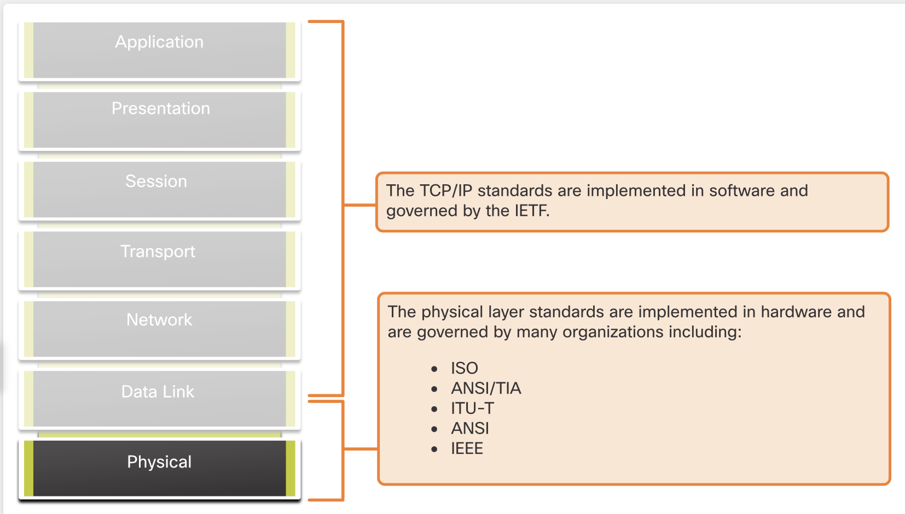

The physical layer standards address three functional areas:
• Physical Components
• Encoding
• Signaling
The physical components are the electronic hardware devices, media, and other connectors that transmit the signals that represent the bits. Hardware components such as NICs, interfaces and connectors, cable materials, and cable designs are all specified in standards associated with the physical layer. The various ports and interfaces on a Cisco 1941 router are also examples of physical components with specific connectors and pinouts resulting from standards.

Encoding or line encoding is a method of converting a stream of data bits into a predefined "code". Codes are groupings of bits used to provide a predictable pattern that can be recognized by both the sender and the receiver. In other words, encoding is the method or pattern used to represent digital information. This is similar to how Morse code encodes a message using a series of dots and dashes.
For example, Manchester encoding represents a 0 bit by a high to low voltage transition, and a 1 bit is represented as a low to high voltage transition. An example of Manchester encoding is illustrated in the figure. The transition occurs at the middle of each bit period.
This type of encoding is used in 10 Mbps Ethernet. Faster data rates require more complex encoding. Manchester encoding is used in older Ethernet standards such as 10BASE-T. Ethernet 100BASE-TX uses 4B/5B encoding and 1000BASE-T uses 8B/10B encoding.

The physical layer must generate the electrical, optical, or wireless signals that represent the "1" and "O" on the media. The way that bits are represented is called the signaling method. The physical layer standards must define what type of signal represents a "1" and what type of signal represents a "O". This can be as simple as a change in the level of an electrical signal or optical pulse. For example, a long pulse might represent a 1 whereas a short pulse might represent a 0.
This is similar to the signaling method used in Morse code, which may use a series of on-off tones, lights, or clicks to send text over telephone wires or between ships at sea.
Copper
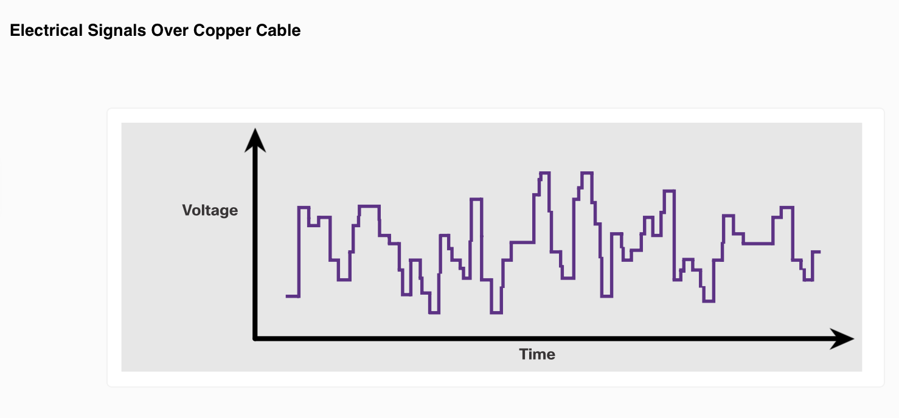

Fiber optic cable 
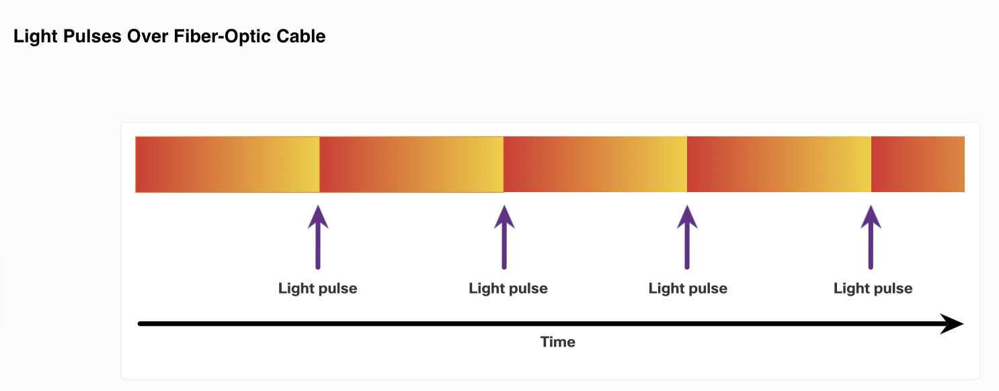

Wireless
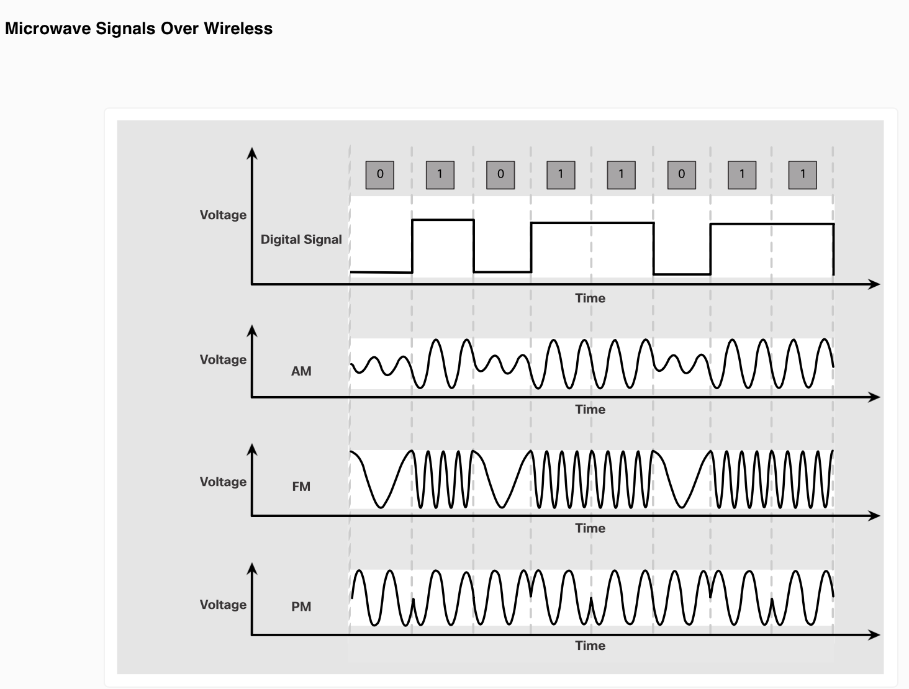

Different physical media support the transfer of bits at different rates. Data transfer is usually discussed in terms of bandwidth. Bandwidth is the capacity at which a medium can carry data. Digital bandwidth measures the amount of data that can flow from one place to another in a given amount of time. Bandwidth is typically measured in kilobits per second (kbps), megabits per second (Mbps), or gigabits per second (Gbps). Bandwidth is sometimes thought of as the speed that bits travel, however this is not accurate. For example, in both 10Mbps and 100Mbps Ethernet, the bits are sent at the speed of electricity. The difference is the number of bits that are transmitted per second.
A combination of factors determines the practical bandwidth of a network:
• The properties of the physical media
• The technologies chosen for signaling and detecting network signals
Physical media properties, current technologies, and the laws of physics all play a role in determining the available bandwidth.
The table shows the commonly used units of measure for bandwidth.
Unit of Bandwidth
Abbreviation
Equivalence
Bits per second
bps
1 bps = fundamental unit of bandwidth
Kilobits per second
Kbps
1 Kbps = 1,000 bps = 103 bps
Megabits per second
Mbps
1 Mbps = 1,000,000 bps = 10° bps
Gigabits per second
Gbps
1 Gbps = 1,000,000,000 bps = 10º bps
Terabits per second
Tbps
1 Tbps = 1,000,000,000,000 bps = 1012 bps

Terms used to measure the quality of bandwidth include:
• Latency
• Throughput
• Goodput
Latency
Latency refers to the amount of time, including delays, for data to travel from one given point to another.
In an internetwork, or a network with multiple segments, throughput cannot be faster than the slowest link in the path from source to destination. Even if all, or most, of the segments have high bandwidth, it will only take one segment in the path with low throughput to create a bottleneck in the throughput of the entire network.
Throughput
Throughput is the measure of the transfer of bits across the media over a given period of time.
Due to a number of factors, throughput usually does not match the specified bandwidth in physical layer implementations. Throughput is usually lower than the bandwidth. There are many factors that influence throughput:
• The amount of traffic
• The type of traffic
• The latency created by the number of network devices encountered between source and destination
There are many online speed tests that can reveal the throughput of an internet connection. The figure provides sample results from a speed test.
Goodput
There is a third measurement to assess the transfer of usable data; it is known as goodput. Goodput is the measure of usable data transferred over a given period of time. Goodput is throughput minus traffic overhead for establishing sessions, acknowledgments, encapsulation, and retransmitted bits. Goodput is always lower than throughput, which is generally lower than the bandwidth.
### 4.3. Copper Cabling
Copper cabling is the most common type of cabling used in networks today. In fact, copper cabling is not just one type of cable. There are three different types of copper cabling that are each used in specific situations.
Networks use copper media because it is inexpensive, easy to install, and has low resistance to electrical current. However, copper media is limited by distance and signal interference.
Data is transmitted on copper cables as electrical pulses. A detector in the network interface of a destination device must receive a signal that can be successfully decoded to match the signal sent. However, the farther the signal travels, the more it deteriorates. This is referred to as signal attenuation. For this reason, all copper media must follow strict distance limitations as specified by the guiding standards.
The timing and voltage values of the electrical pulses are also susceptible to interference from two sources:
• Electromagnetic interference (EMI) or radio frequency interference (RFI) - EMI and RFI signals can distort and corrupt the data signals being carried by copper media. Potential sources of EMI and RFI include radio waves and electromagnetic devices, such as fluorescent lights or electric motors.
• Crosstalk - Crosstalk is a disturbance caused by the electric or magnetic fields of a signal on one wire to the signal in an adjacent wire. In telephone circuits, crosstalk can result in hearing part of another voice conversation from an adjacent circuit. Specifically, when an electrical current flows through a wire, it creates a small, circular magnetic field around the wire, which can be picked up by an adjacent wire.
The figure shows how data transmission can be affected by interference.
To counter the negative effects of EMI and RFI, some types of copper cables are wrapped in metallic shielding and require proper
grounding connections.
To counter the negative effects of crosstalk, some types of copper cables have opposing circuit wire pairs twisted together, which effectively cancels the crosstalk.
The susceptibility of copper cables to electronic noise can also be limited using these recommendations:
• Selecting the cable type or category most suited to a given networking environment
• Designing a cable infrastructure to avoid known and potential sources of interference in the building structure
• Using cabling techniques that include the proper handling and termination of the cables
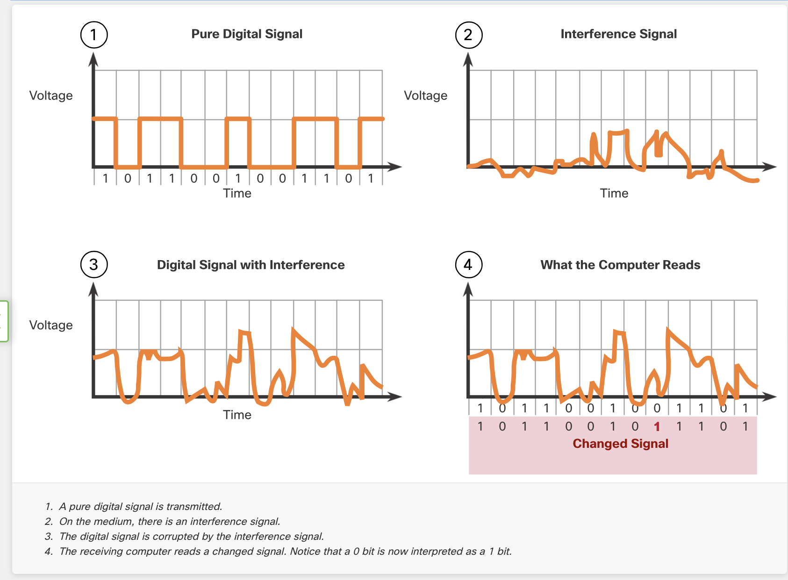

There are 3 types of copper media used.
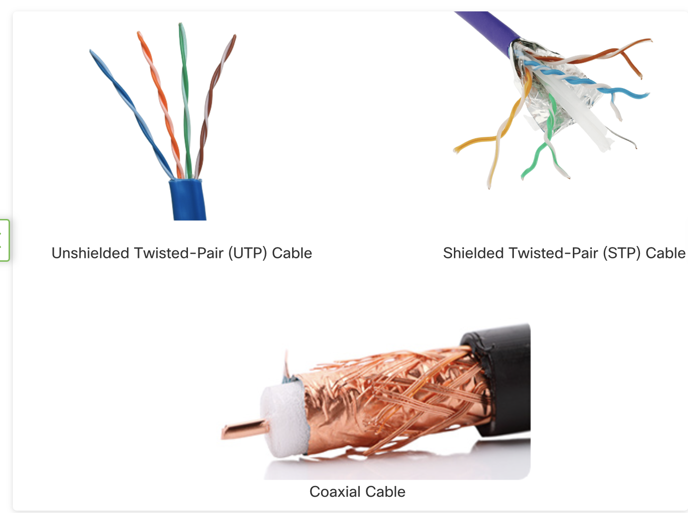

UTP
Unshielded twisted-pair (UTP) cabling is the most common networking media. UTP cabling, terminated with RJ-45 connectors, is used for interconnecting network hosts with intermediary networking devices, such as switches and routers.
In LANs, UTP cable consists of four pairs of color-coded wires that have been twisted together and then encased in a flexible plastic sheath that protects from minor physical damage. The twisting of wires helps protect against signal interference from other wires.
The numbers in the figure identify some key characteristics of unshielded twisted-pair cable:
1. The outer jacket protects the copper wires from physical damage.
2. Twisted-pairs protect the signal from interference.
3. Color-coded plastic insulation electrically isolates wires from each other and identifies each pair.
STP
Shielded twisted-pair (STP) provides better noise protection than UTP cabling. However, compared to UTP cable, STP cable is significantly more expensive and difficult to install. Like UTP cable, STP uses an RJ-45 connector.
STP cables combine the techniques of shielding to counter EMI and RFI, and wire twisting to counter crosstalk. To gain the full benefit of the shielding, STP cables are terminated with special shielded STP data connectors. If the cable is improperly grounded, the shield may act as an antenna and pick up unwanted signals.

The numbers in the figure identify some key features of shielded twisted-pair cable:
1. Outer jacket
2. Braided or foil shield
3. Foil shields
4. Twisted pairs

Coaxial
Coaxial cable, or coax for short, gets its name from the fact that there are two conductors that share the same axis.
As shown in the figure, coaxial cable consists of the following:
• A copper conductor is used to transmit the electronic signals.
• A layer of flexible plastic insulation surrounds a copper conductor.
• The insulating material is surrounded in a woven copper braid, or metallic foil, that acts as the second wire in the circuit and as a shield for the inner conductor. This second layer, or shield, also reduces the amount of outside electromagnetic interference.
• The entire cable is covered with a cable jacket to prevent minor physical damage.
There are different types of connectors used with coax cable. The Bayonet Neill-Concelman (BNC), N type, and F type connectors are shown in the figure.
Although UTP cable has essentially replaced coaxial cable in modern Ethernet installations, the coaxial cable design is used in the following situations:
• Wireless installations - Coaxial cables attach antennas to wireless devices. The coaxial cable carries radio frequency (RF) energy between the antennas and the radio equipment.
• Cable internet installations - Cable service providers provide internet connectivity to their customers by replacing portions of the coaxial cable and supporting amplification elements with fiber-optic cable. However, the wiring inside the customer's premises is still coax cable.

The numbers in the figure identify some key features of coaxial cable:
1. Outer jacket
2. Braided copper shielding
3. Plastic insulation
4. Copper conductor
### 4.4. UTP Cabling
In the previous topic, you learned a bit about unshielded twisted-pair (UTP) copper cabling. Because UTP cabling is the standard for use in LANs, this topic goes into detail about its advantages and limitations, and what can be done to avoid problems.
When used as a networking medium, UTP cabling consists of four pairs of color-coded copper wires that have been twisted together and then encased in a flexible plastic sheath. Its small size can be advantageous during installation.
UTP cable does not use shielding to counter the effects of EMI and RFI. Instead, cable designers have discovered other ways that they can limit the negative effect of crosstalk:
• Cancellation - Designers now pair wires in a circuit. When two wires in an electrical circuit are placed close together, their magnetic fields are the exact opposite of each other. Therefore, the two magnetic fields cancel each other and also cancel out any outside EMI and RFI signals.
• Varying the number of twists per wire pair - To further enhance the cancellation effect of paired circuit wires, designers vary the number of twists of each wire pair in a cable. UP cable must follow precise specifications governing how many twists or braids are permitted per meter (3.28 feet) of cable. Notice in the figure that the orange/orange white pair is twisted less than the blue/blue white pair. Each colored pair is twisted a different number of times.
UTP cable relies solely on the cancellation effect produced by the twisted wire pairs to limit signal degradation and effectively provide self-shielding for wire pairs within the network media.

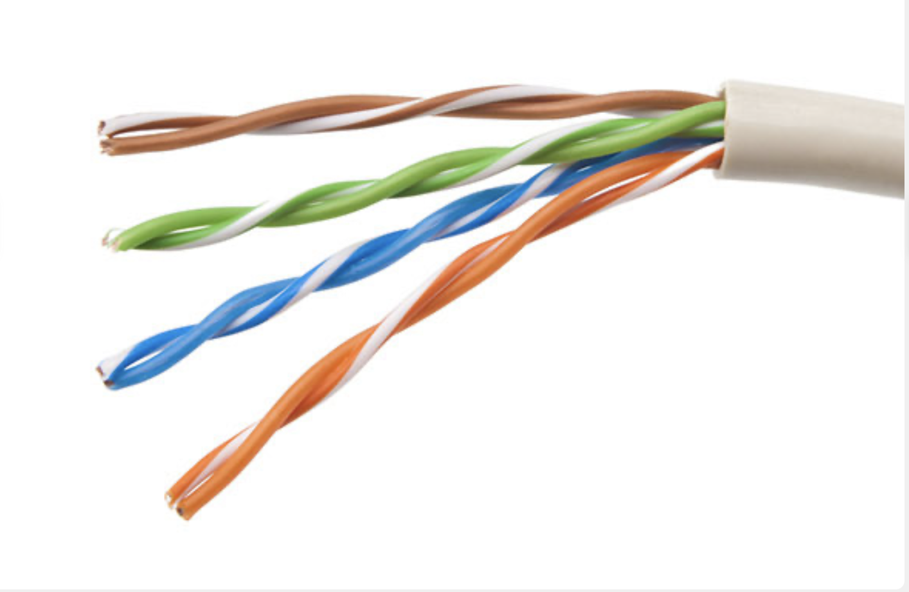

UTP cabling conforms to the standards established jointly by the TIA/EIA. Specifically, TIA/EIA-568 stipulates the commercial cabling standards for LAN installations and is the standard most commonly used in LAN cabling environments. Some of the elements defined are as follows:
• Cable types
• Cable lengths
• Connectors
• Cable termination
• Methods of testing cable
The electrical characteristics of copper cabling are defined by the Institute of Electrical and Electronics Engineers
(IEEE). IEEE rates UP cabling according to its performance. Cables are placed into categories based on their ability to carry higher bandwidth rates. For example, Category 5 cable is used commonly in 100BASE-TX Fast Ethernet installations. Other categories include Enhanced Category 5 cable, Category 6, and Category 6a.
Cables in higher categories are designed and constructed to support higher data rates. As new gigabit speed Ethernet technologies are being developed and adopted, Category 5e is now the minimally acceptable cable type, with Category 6 being the recommended type for new building installations.
The figure shows three categories of UTP cable:
• Category 3 was originally used for voice communication over voice lines, but later used for data transmission.
• Category 5 and 5e is used for data transmission. Category 5 supports 100Mbps and Category 5e supports 1000
Mbps
• Category 6 has an added separator between each wire pair to support higher speeds. Category 6 supports up to 10 Gbps.
• Category 7 also supports 10 Gbps.
• Category 8 supports 40 Gbps.
Some manufacturers are making cables exceeding the TIA/EIA Category 6a specifications and refer to these as
Category 7.

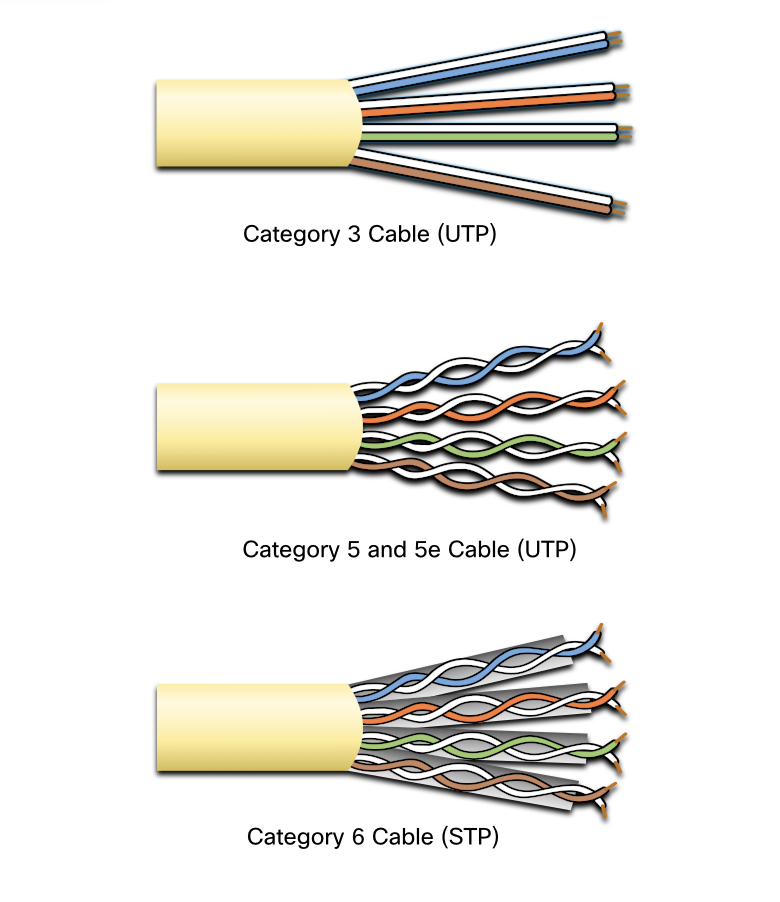
UTP cable is usually terminated with an RJ-45 connector. The TIA/EIA-568 standard describes the wire color codes to pin assignments (pinouts) for Ethernet cables.
As shown in the figure, the Ru-45 connector is the male component, crimped at the end of the cable.

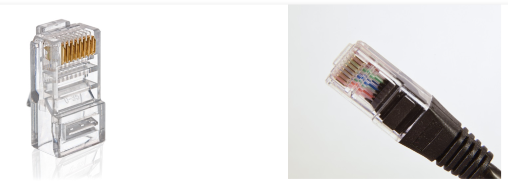

The socket, shown in the figure, is the female component of a network device, wall, cubicle partition outlet, or patch panel. When terminated improperly, each cable is a potential source of physical layer performance degradation.

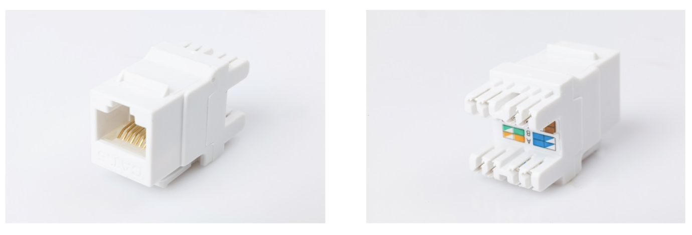

This figure shows an example of a badly terminated UTP cable. This bad connector has wires that are exposed,
untwisted, and not entirely covered by the sheath.

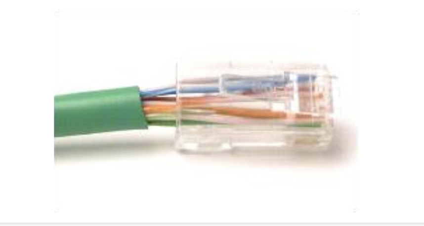

The next figure shows a properly terminated UP cable. It is a good connector with wires that are untwisted only to the extent necessary to attach the connector.

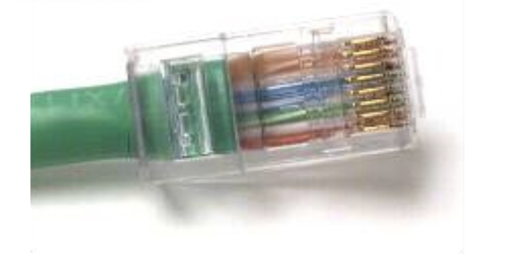

Different situations may require UTP cables to be wired according to different wiring conventions. This means that the individual wires in the cable have to be connected in different orders to different sets of pins in the RJ-45 connectors.
The following are the main cable types that are obtained by using specific wiring conventions:
• Ethernet Straight-through - The most common type of networking cable. It is commonly used to interconnect a host to a switch and a switch to a router.
• Ethernet Crossover - A cable used to interconnect similar devices. For example, to connect a switch to a switch, a host to a host, or a router to a router. However, crossover cables are now considered legacy as NICs use medium-dependent interface crossover (auto-MDIX) to automatically detect the cable type and make the internal connection.
Note: Another type of cable is a rollover cable, which is Cisco proprietary. It is used to connect a workstation to a router or switch console port.
Using a crossover or straight-through cable incorrectly between devices may not damage the devices, but connectivity and communication between the devices will not take place. This is a common error and checking that the device connections are correct should be the first troubleshooting action if connectivity is not achieved.
The figure identifies the individual wire pairs for the T568A and T568B standards.

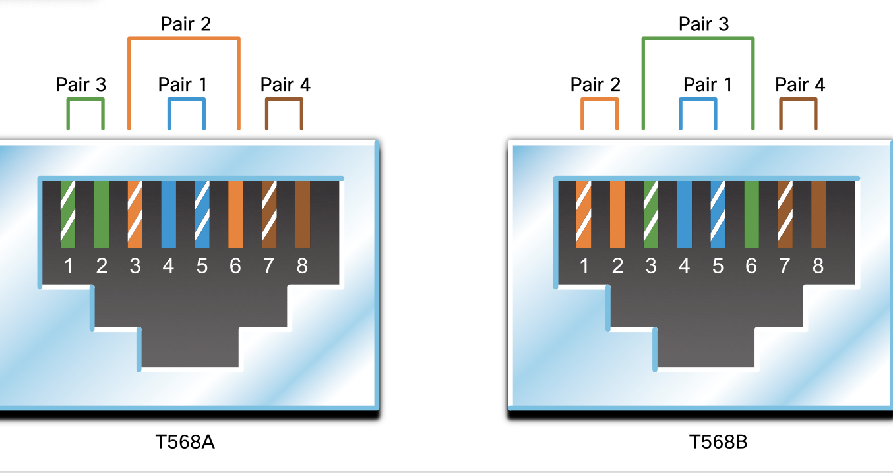

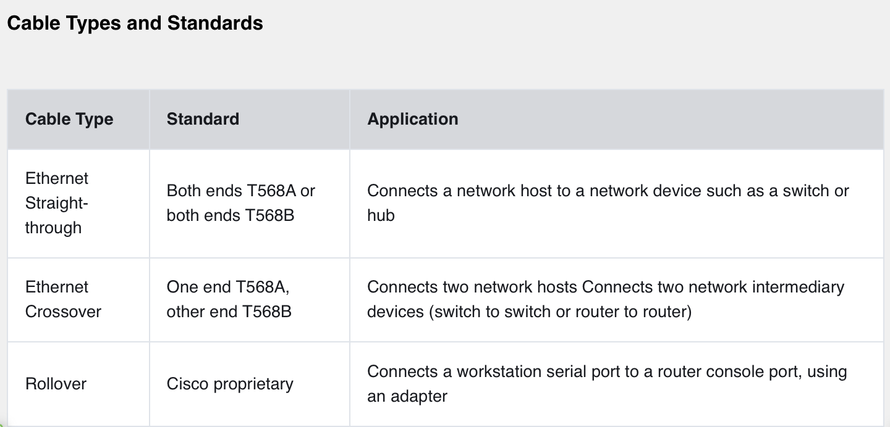

### 4.5. Fiber-Optic Cabling

As you have learned, fiber-optic cabling is the other type of cabling used in networks. Because it is expensive, it is not as commonly used at the various types of copper cabling. But fiber-optic cabling has certain properties that make it the best option in certain situations, which you will discover in this topic.
Optical fiber cable transmits data over longer distances and at higher bandwidths than any other networking media. Unlike copper wires, fiber-optic cable can transmit signals with less attenuation and is completely immune to EMI and RFI. Optical fiber is commonly used to interconnect network devices.
Optical fiber is a flexible, but extremely thin, transparent strand of very pure glass, not much bigger than a human hair. Bits are encoded on the fiber as light impulses. The fiber-optic cable acts as a waveguide, or "light pipe," to transmit light between the two ends with minimal loss of signal.
As an analogy, consider an empty paper towel roll with the inside coated like a mirror. It is a thousand meters in length, and a small laser pointer is used to send Morse code signals at the speed of light. Essentially that is how a fiber-optic cable operates, except that it is smaller in diameter and uses sophisticated light technologies.
Fiber-optic cables are broadly classified into two types:
• Single-mode fiber (SMF)
• Multimode fiber (MMF)

Single-Mode Fiber
SMF consists of a very small core and uses expensive laser technology to send a single ray of light, as shown in the figure. SMF is popular in long-distance situations spanning hundreds of kilometers, such as those required in long haul telephony and cable TV applications.

Multimode Fiber
MMF consists of a larger core and uses LED emitters to send light pulses. Specifically, light from an LED enters the multimode fiber at different angles, as shown in the figure. MMs are popular in LANs because they can be powered by low-cost LEDs. It provides bandwidth up to 10 Gbps over link lengths of up to 550 meters.

One of the highlighted differences between MMF and SMF is the amount of dispersion. Dispersion refers to the spreading out of a light pulse over time. Increased dispersion means increased loss of signal strength. MMF has a greater dispersion than SMF. That is why MMF can only travel up to 500 meters before signal loss.

Fiber-optic cabling is now being used in four types of industry:
• Enterprise Networks - Used for backbone cabling applications and interconnecting infrastructure devices
• Fiber-to-the-Home (FTTH) - Used to provide always-on broadband services to homes and small businesses
• Long-Haul Networks - Used by service providers to connect countries and cities
• Submarine Cable Networks - Used to provide reliable high-speed, high-capacity solutions capable of surviving in harsh undersea environments at up to transoceanic distances. Search the internet for "submarine cables telegeography map" to view various maps online.
Our focus in this course is the use of fiber within the enterprise.

An optical-fiber connector terminates the end of an optical fiber. A variety of optical-fiber connectors are available. The main differences among the types of connectors are dimensions and methods of coupling. Businesses decide on the types
of connectors that will be used, based on their equipment.
Note: Some switches and routers have ports that support fiber-optic connectors through a small form-factor pluggable
(SFP) transceiver. Search the internet for various types of SFPs.

ST connectors were one of the first connector types used. The connector locks securely with a twist-on/twist-off* bayonet-style mechanism.
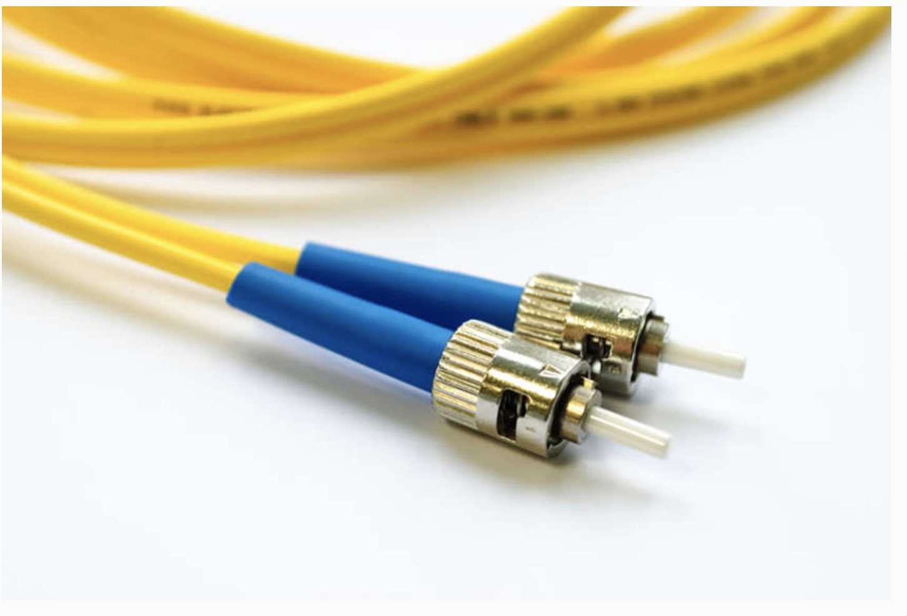

SC connectors are sometimes referred to as 'square connectors' or 'standard connectors. They are a widely-adopted LAN and WAN connector that uses a push-pull mechanism to ensure positive insertion. This connector type is used with multimode and single-mode fiber.
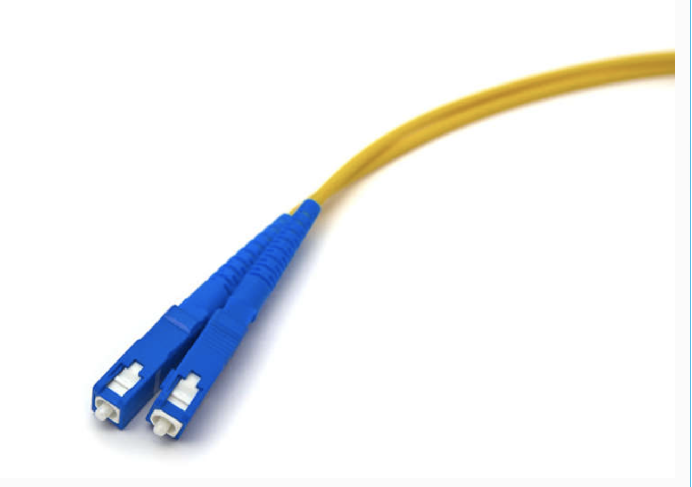

LC simplex connectors are a smaller version of the SC connector. These are sometimes called little or local connectors and are quickly growing in popularity due to their smaller size.
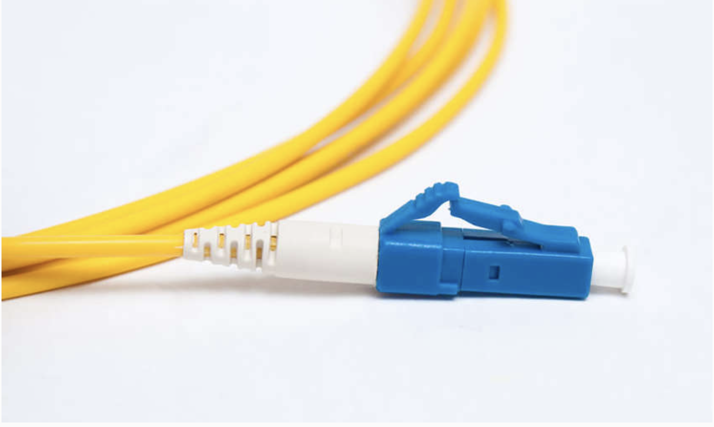

A duplex multimode LC connector is similar to an LC simplex connector, but uses a duplex connector.
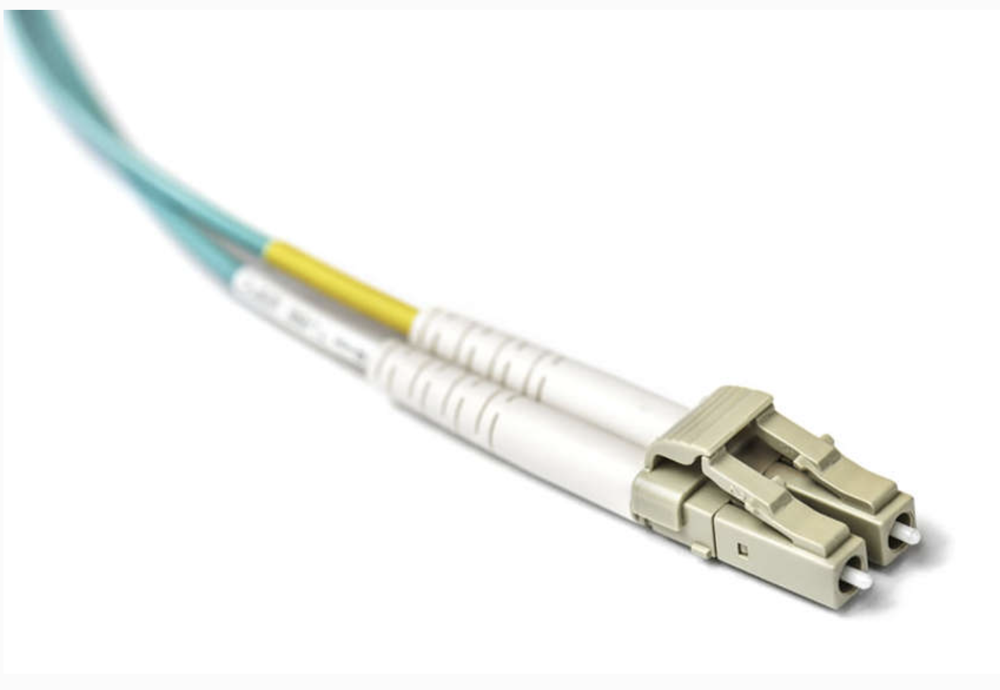

Until recently, light could only travel in one direction over optical fiber. Two fibers were required to support the full duplex operation. Therefore, fiber-optic patch cables bundle together two optical fiber cables and terminate them with a pair of standard, single-fiber connectors. Some fiber connectors accept both the transmitting and receiving fibers in a single connector known as a duplex connector, as shown in the Duplex Multimode LC Connector in the figure. BX standards such as 100BASE-BX use different wavelengths for sending and receiving over a single fiber.

Fiber patch cords are required for interconnecting infrastructure devices. The use of color distinguishes between single-mode and multimode patch cords. A yellow jacket is for single-mode fiber cables and orange (or aqua) for multimode fiber cables.

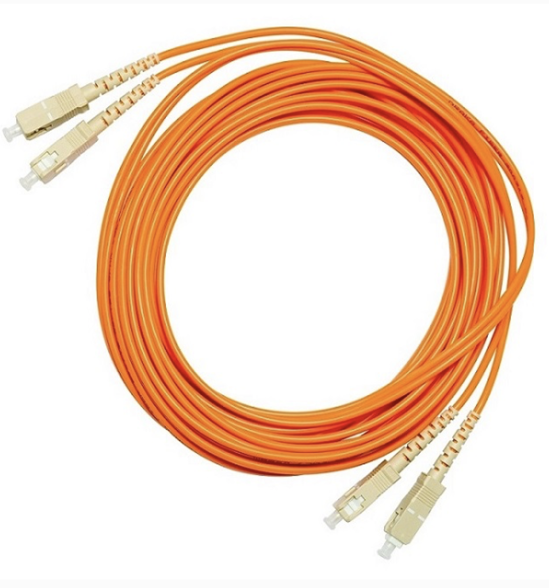

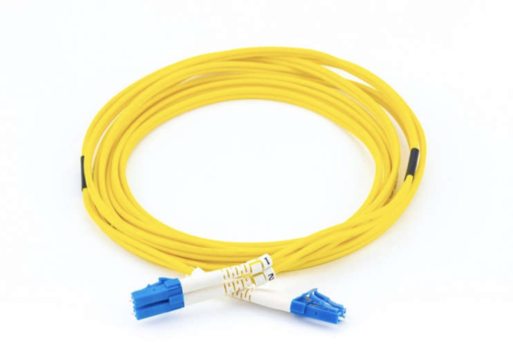

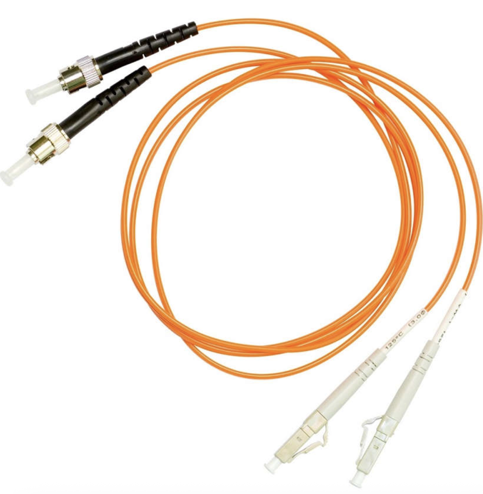

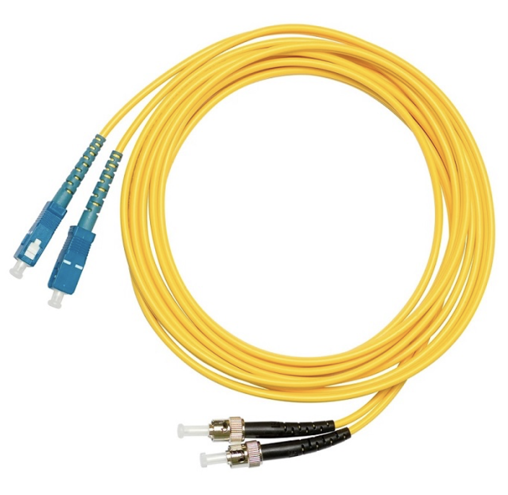

There are many advantages to using fiber-optic cable compared to copper cables. The table highlights some of these differences.
At present, in most enterprise environments, optical fiber is primarily used as backbone cabling for high-traffic, point-to-point connections between data distribution facilities. It is also used for the interconnection of buildings in multi-building campuses. Because fiber-optic cables do not conduct electricity and have a low signal loss, they are well suited for these uses.

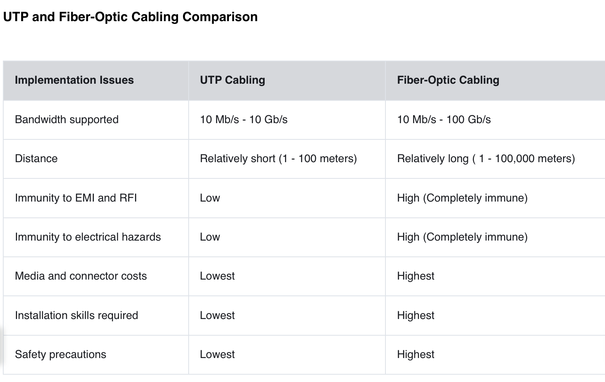

### 4.6. Wireless Media

You may be taking this course using a tablet or a smart phone. This is only possible due to wireless media, which is the third way to connect to the physical layer of a network.
Wireless media carry electromagnetic signals that represent the binary digits of data communications using radio or microwave frequencies.
Wireless media provide the greatest mobility options of all media, and the number of wireless-enabled devices continues to increase. Wireless is now the primary way users connect to home and enterprise networks.
These are some of the limitations of wireless:
• Coverage area - Wireless data communication technologies work well in open environments. However, certain construction materials used in buildings and structures, and the local terrain, will limit the effective coverage.
• Interference - Wireless is susceptible to interference and can be disrupted by such common devices as household cordless phones, some types of fluorescent lights, microwave ovens, and other wireless communications.
• Security - Wireless communication coverage requires no access to a physical strand of media. Therefore, devices and users, not authorized for access to the network, can gain access to the transmission. Network security is a major component of wireless network administration.
• Shared medium - WLANs operate in half-duplex, which means only one device can send or receive at a time. The wireless medium is shared amongst all wireless users. Many users accessing the WLAN simultaneously results in reduced bandwidth for each user.
Although wireless is increasing in popularity for desktop connectivity, copper and fiber are the most popular physical layer media for deployment of intermediary network devices, such as routers and switches.

The lEEE and telecommunications industry standards for wireless data communications cover both the data link and physical layers. In each of these standards, physical layer specifications are applied to areas that include the following:
• Data to radio signal encoding
• Frequency and power of transmission
• Signal reception and decoding requirements
• Antenna design and construction
These are the wireless standards:
• Wi-Fi (IEEE 802.11) - Wireless LAN (WLAN) technology, commonly referred to as Wi-Fi. WLAN uses a contention-based protocol known as carrier sense multiple access/collision avoidance (CSMA/CA). The wireless NIC must first listen before transmitting to determine if the radio channel is clear. If another wireless device is transmitting, then the NIC must wait until the channel is clear. Wi-Fi is a trademark of the Wi-Fi Alliance. Wi-Fi is used with certified WLAN devices based on the IEEE 802.11 standards.
• Bluetooth (IEEE 802.15) - This is a wireless personal area network (WPAN) standard, commonly known as
"Bluetooth." It uses a device pairing process to communicate over distances from 1 to 100 meters.
• WiMAX (LEEE 802.16) - Commonly known as Worldwide Interoperability for Microware Access (WiMAX), this wireless standard uses a point-to-multipoint topology to provide wireless broadband access.
• Zigbee (IEEE 802.15.4) - Zigbee is a specification used for low-data rate, low-power communications. It is intended for applications that require short-range, low data-rates and long battery life. Zigbee is typically used for industrial and Internet of Things (loT) environments such as wireless light switches and medical device data collection.
Note: Other wireless technologies such as cellular and satellite communications can also provide data network connectivity. However, these wireless technologies are out of scope for this module.

A common wireless data implementation is enabling devices to connect wirelessly via a LAN. In general, a WLAN requires the following network devices:
• Wireless Access Point (AP) - These concentrate the wireless signals from users and connect to the existing copper-based network infrastructure, such as Ethernet. Home and small business wireless routers integrate the functions of a router, switch, and access point into one device, as shown in the figure.
• Wireless NIC adapters - These provide wireless communication capability to network hosts.
As the technology has developed, a number of WLAN Ethernet-based standards have emerged. When purchasing wireless devices, ensure compatibility and interoperability.
The benefits of wireless data communications technologies are evident, especially the savings on costly premises wiring and the convenience of host mobility. Network administrators must develop and apply stringent security policies and processes to protect WLANs from unauthorized access and damage.