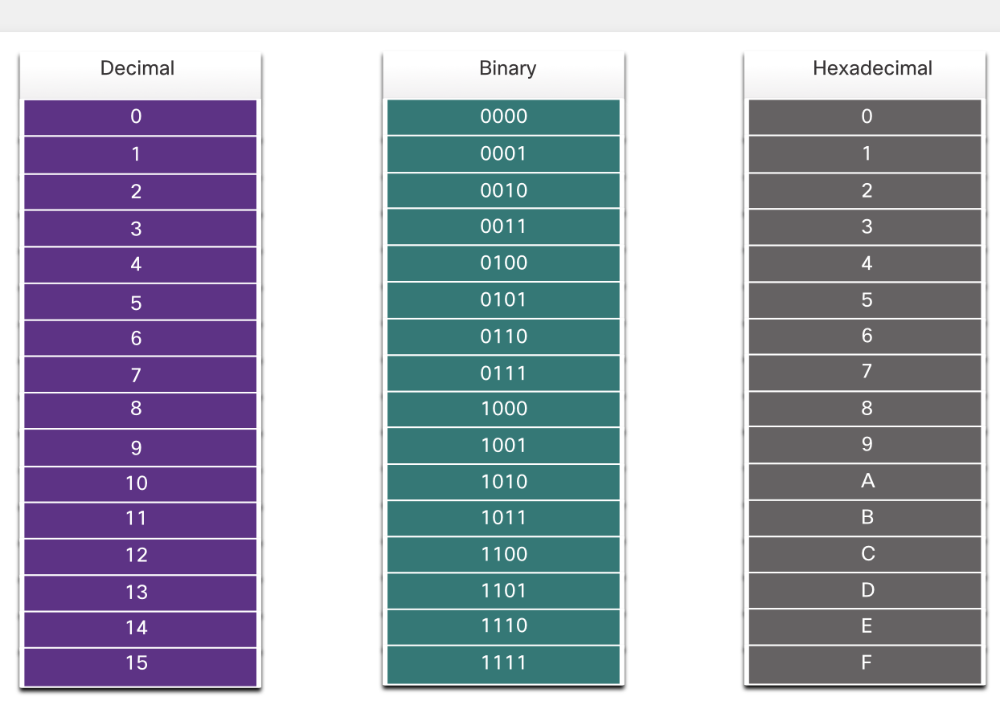

### 5 Number Systems 
Why should I take this module?
Welcome to Number Systems!
Guess what? This is a 32-bit IPv4 address of a computer in a network:
11000000.10101000.00001010.00001010. It is shown in binary. This is the IPv4 address for the same computer in dotted decimal: 192.168.10.10. Which one would you rather work with? IPv6 addresses are 128 bits! To make these addresses more manageable, IPv6 uses a hexadecimal system of 0-9 and the letters A-F.
As a network administrator you must know how to convert binary addresses into dotted decimal and dotted decimal addresses into binary. You will also need to know how to convert dotted decimal into hexadecimal and vice versa. (Hint: You still need your binary conversion skills to make this work.)
Surprisingly, it is not that hard when you learn a few tricks. This module contains an activity called the Binary Game which will really help you get started. So, why wait?
### 5.1 Binary Number System 
IPv4 addresses begin as binary, a series of only 1s and Os. These are difficult to manage, so network administrators must convert them to decimal. This topic shows you a few ways to do this.
Binary is a numbering system that consists of the digits 0 and 1 called bits. In contrast, the decimal numbering system consists of 10 digits consisting of the digits 0 - 9.
Binary is important for us to understand because hosts, servers, and network devices use binary addressing.
Specifically, they use binary IPv4 addresses, as shown in the figure, to identify each other.

Each address consists of a string of 32 bits, divided into four sections called octets. Each octet contains 8 bits (or 1 byte) separated with a dot. For example, PC1 in the figure is assigned IPv4 address 11000000.10101000.00001010.00001010. Its default gateway address would be that of R1 Gigabit Ethernet interface 11000000.10101000.00001010.00000001.
Binary works well with hosts and network devices. However, it is very challenging for humans to work with.
For ease of use by people, IPv4 addresses are commonly expressed in dotted decimal notation. PC1 is assigned the IPv4 address 192.168.10.10, and its default gateway address is 192.168.10.1, as shown in the figure.

For a solid understanding of network addressing, it is necessary to know binary addressing and gain practical skills converting between binary and dotted decimal IPv4 addresses. This section will cover how to convert between base two (binary) and base 10 (decimal) numbering systems.

Learning to convert binary to decimal requires an understanding of positional notation. Positional notation means that a digit represents different values depending on the "position" the digit occupies in the sequence of numbers. You already know the most common numbering system, the decimal (base 10) notation system.
The decimal positional notation system operates as described in the table.

The following bullets describe each row of the table.
• Row 1, Radix is the number base. Decimal notation is based on 10, therefore the radix is 10.
• Row 2, Position in number considers the position of the decimal number starting with, from right to left, O (1st position), 1 (2nd position), 2 (3rd position), 3 (4th position). These numbers also represent the
exponential value use to calculate the positional value in the 4th row.
• Row 3 calculates the positional value by taking the radix and raising it by the exponential value of its
position in row 2.
Note: n° is = 1.
• Row 4 positional value represents units of thousands, hundreds, tens, and ones.
To use the positional system, match a given number to its positional value. The example in the table illustrates how positional notation is used with the decimal number 1234.
The following bullets describe each row of the table.
• Row 1, Radix is the number base. Binary notation is based on 2, therefore the radix is 2.
• Row 2, Position in number considers the position of the binary number starting with, from right to left, 0 (1 st position), 1 (2nd position), 2 (3rd position), 3 (4th position). These numbers also represent the exponential value use to calculate the positional value in the 4th row.
• Row 3 calculates the positional value by taking the radix and raising it by the exponential value of its position in row 2.
Note: n° is = 1.
• Row 4 positional value represents units of ones, twos, fours, eights, etc.
The example in the table illustrates how a binary number 11000000 corresponds to the number 192. If the binary number had been 10101000, then the corresponding decimal number would be 168.

To convert a binary IPv4 address to its dotted decimal equivalent, divide the IPv4 address into four 8-bit octets.
Next apply the binary positional value to the first octet binary number and calculate accordingly.
For example, consider that 11000000. 10101000.00001011.00001010 is the binary IPv4 address of a host. To convert the binary address to decimal, start with the first octet, as shown in the table. Enter the 8-bit binary number under the positional value of row 1 and then calculate to produce the decimal number 192. This number goes into the first octet of the dotted decimal notation.

It is also necessary to understand how to convert a dotted decimal IPv4 address to binary. A useful tool is the binary positional value table.

To help understand the process, consider the IP address 192.168.10.11.
The first octet number 192 is converted to binary using the previously explained positional notation process.
It is possible to bypass the process of subtraction with easier or smaller decimal numbers. For instance, notice that it is fairly easy to calculate the third octet converted to a binary number without actually going through the
subtraction process (8 + 2 = 10). The binary value of the third octet is 00001010.
The fourth octet is 11 (8 + 2 + 1). The binary value of the fourth octet is 00001011.
Converting between binary and decimal may seem challenging at first, but with practice it should become easier over time.

### 5.2 Hexadecimal Number System
Now you know how to convert binary to decimal and decimal to binary. You need that skill to understand IPv4 addressing in your network. But you are just as likely to be using IPv6 addresses in your network. To understand IPv6 addresses, you must be able to convert hexadecimal to decimal and vice versa.
Just as decimal is a base ten number system, hexadecimal is a base sixteen system. The base sixteen number system uses the digits 0 to 9 and the letters A to F. The figure shows the equivalent decimal and hexadecimal values for binary 0000 to 1111.

Binary and hexadecimal work well together because it is easier to express a value as a single hexadecimal digit
than as four binary bits.
The hexadecimal numbering system is used in networking to represent IP Version 6 addresses and Ethernet
MAC addresses.
IPv6 addresses are 128 bits in length and every 4 bits is represented by a single hexadecimal digit; for a total of 32 hexadecimal values. IPv6 addresses are not case-sensitive and can be written in either lowercase or uppercase.
As shown in the figure, the preferred format for writing an IPv6 address is X::::x::x:x, with each "x" consisting of four hexadecimal values. When referring to 8 bits of an IPv4 address we use the term octet. In IPv6, a hextet is the unofficial term used to refer to a segment of 16 bits or four hexadecimal values. Each "x" is a single hextet,
16 bits, or four hexadecimal digits.

Converting decimal numbers to hexadecimal values is straightforward. Follow the steps listed:
1. Convert the decimal number to 8-bit binary strings.
2. Divide the binary strings in groups of four starting from the rightmost position.
3. Convert each four binary numbers into their equivalent hexadecimal digit.
The example provides the steps for converting 168 to hexadecimal.
For example, 168 converted into hex using the three-step process.
1. 168 in binary is 10101000.
2. 10101000 in two groups of four binary digits is 1010 and 1000.
3. 1010is hex A and 1000 is hex 8.
Answer: 168 is A8 in hexadecimal.

Converting hexadecimal numbers to decimal values is also straightforward. Follow the steps listed:
1. Convert the hexadecimal number to 4-bit binary strings.
2. Create 8-bit binary grouping starting from the rightmost position.
3. Convert each &-bit binary grouping into their equivalent decimal digit.
This example provides the steps for converting D2 to decimal.
1. D2 in 4-bit binary strings is 1101 and 0010.
2. 1101 and 0010 is 11010010 in an 8-bit grouping.
3. 11010010 in binary is equivalent to 210 in decimal.
Answer: D2 in hexadecimal is 210 in decimal.