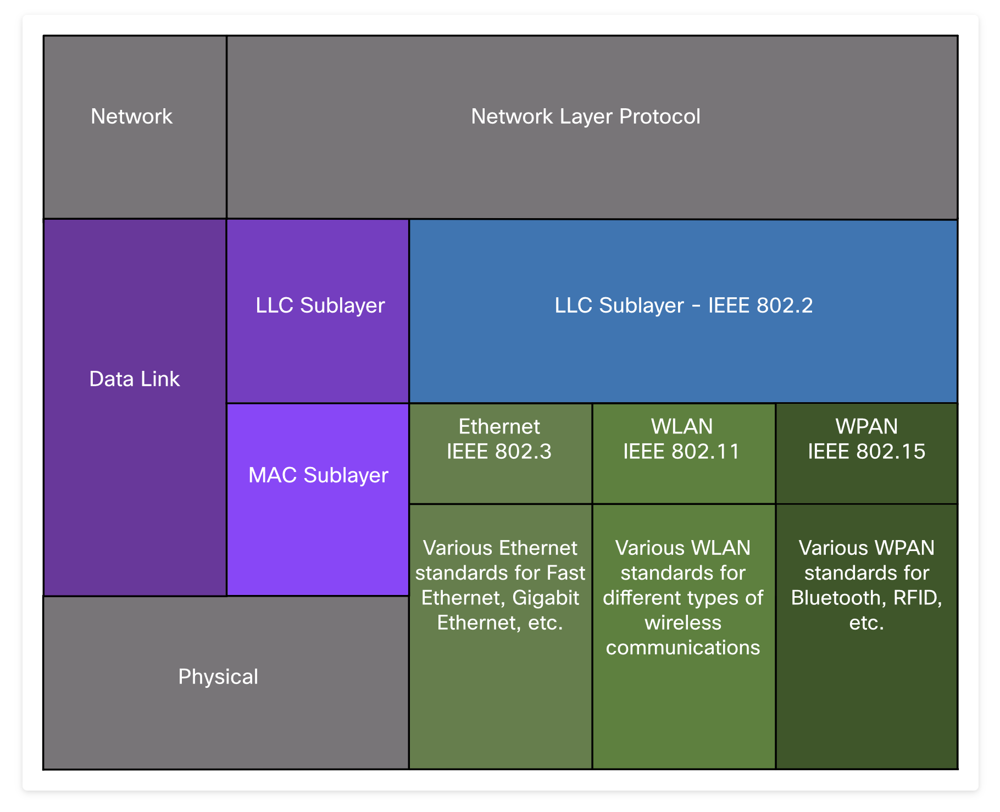
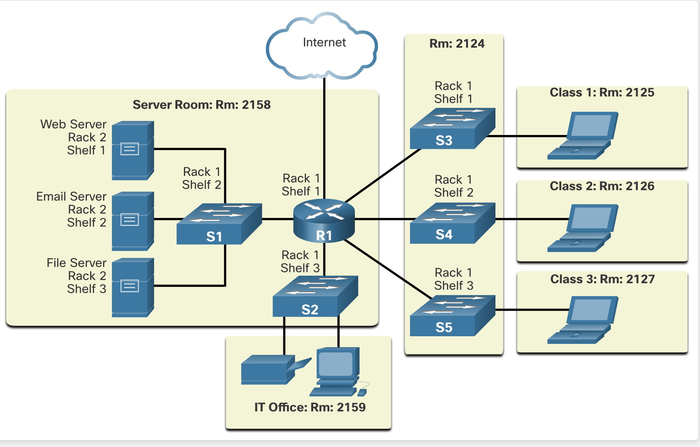
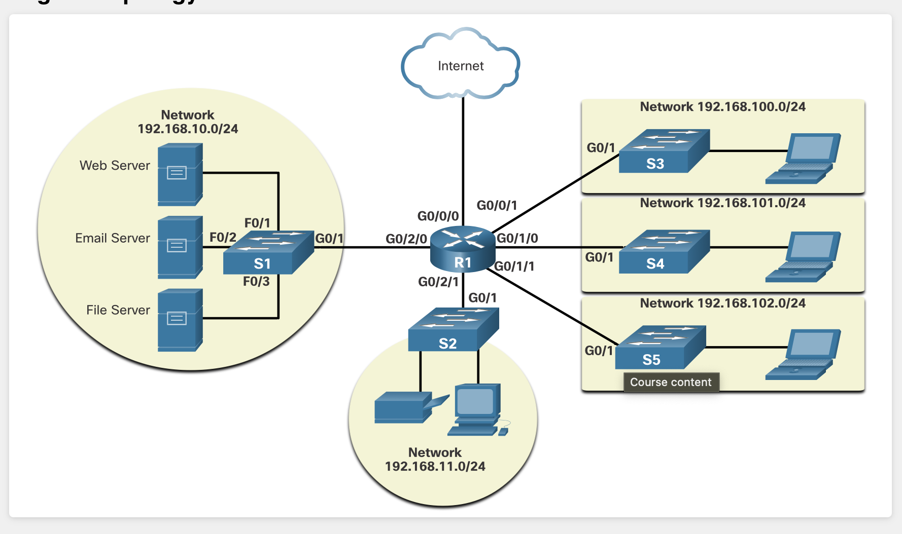
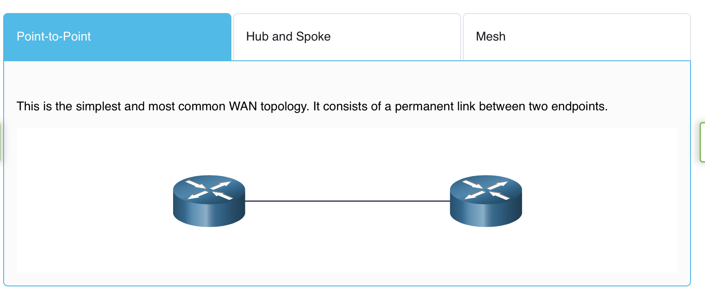
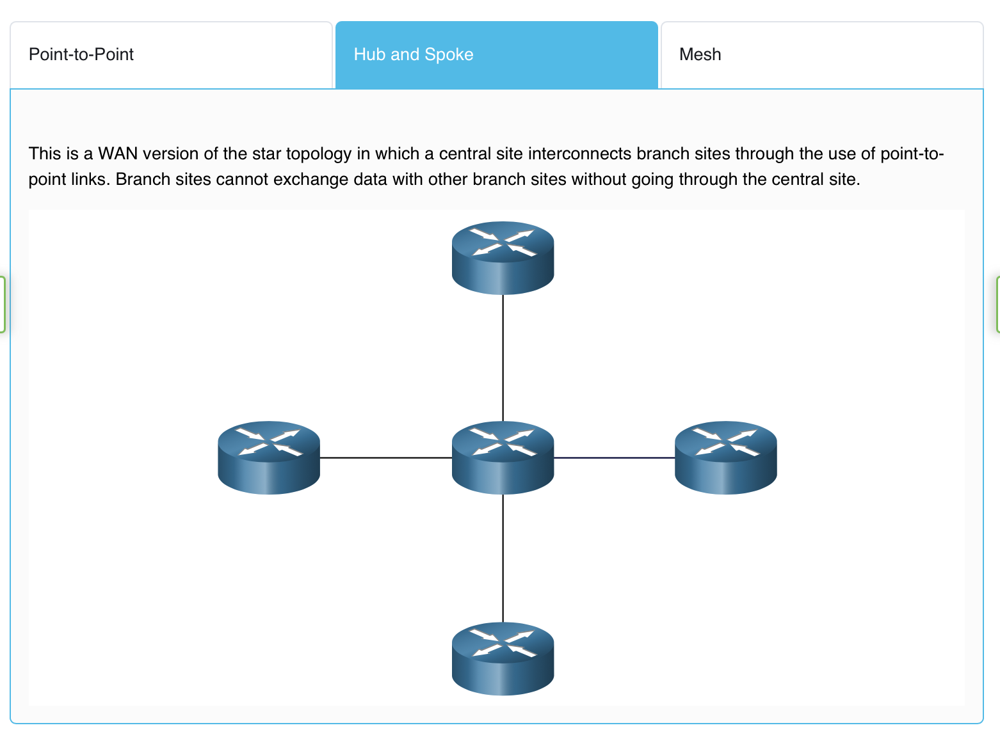
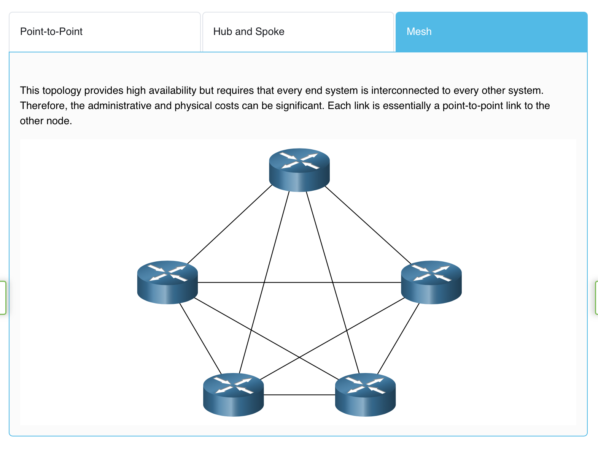
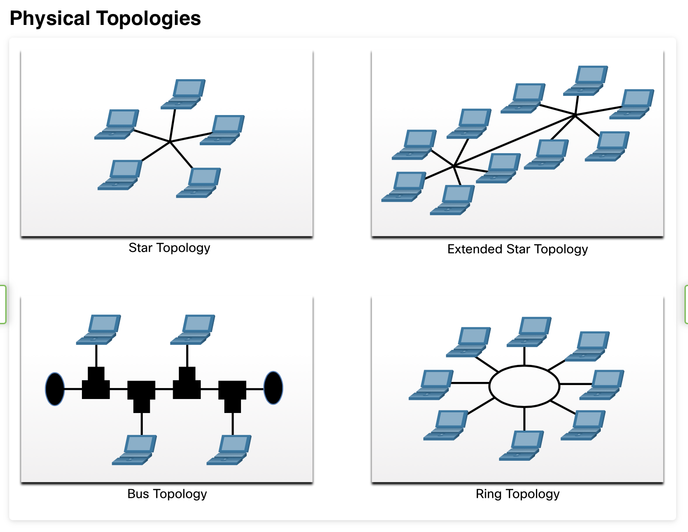
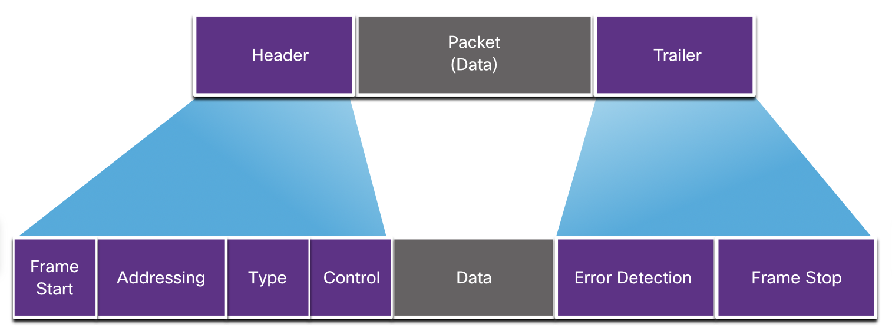

### 6 Datalink Layer 
different medium; water instead of air.
Every network has physical components and media connecting the components. Different types of media need different information about the data in order to accept it and move it across the physical network. Think of it this way: A well-hit golf ball moves through the air fast and far. It can also move through water but not as fast or as far unless it is helped by a more forceful hit. This is because the golf ball is traveling through a

Data must have help to move it across different media. The data link layer provides this help. As you might have guessed, this help differs based on a number of factors. This module gives you an overview of these factors, how they affect data, and the protocols designed to ensure
Welcome to Data Link Layer!
successful delivery. Let's get started!
### 6.1. Purpose of the Data Link Layer

The data link layer of the OSI model (Layer 2), prepares network data for the physical network. The data link layer is responsible for network interface card (NIC) to network interface card communications. The data link layer does the following:
• Enables upper layers to access the media. The upper layer protocol is completely unaware of the type of media that is used to forward the data.
• Accepts data, usually Layer 3 packets (i.e., IPv4 or IPv6), and encapsulates them into Layer 2 frames.
• Controls how data is placed and received on the media.
• Exchanges frames between endpoints over the network media.
• Receives encapsulated data, usually Layer 3 packets, and directs them to the proper upper-layer protocol.
• Performs error detection and rejects anv corrunt frame.

In computer networks, a node is a device that can receive, create, store, or forward data along a communications path. A node can be either an end device such as a laptop or mobile phone, or an intermediary device such as an Ethernet switch.
Without the data link layer, network layer protocols such as IP, would have to make provisions for connecting to every type of media that could exist along a delivery path. Additionally, every time a new network technology or medium was developed IP, would have to adapt.
The figure displays an example of how the data link layer adds Layer 2 Ethernet destination and source NIC information to a Layer 3 packet. It would then convert this information to a format supported by the physical layer (i.e., Layer 1).

IEEE 802 LAN/MAN standards are specific to Ethernet LANs, wireless LANS (WLAN), wireless personal area networks (WPAN) and other types of local and metropolitan area networks. The lEEE 802 LAN/MAN data link layer consists of the following two sublayers:
• Logical Link Control (LLC) - This IEEE 802.2 sublayer communicates between the networking software at the upper layers and the device hardware at the lower layers. It places information in the frame that identifies which network layer protocol is being used for the frame. This information allows multiple Layer 3 protocols, such as IPv4 and IPv6, to use the same network interface and media.
• Media Access Control (MAC) - Implements this sublayer (IEEE 802.3, 802.11, or 802.15) in hardware. It is responsible for data encapsulation and media access control. It provides data link layer addressing and it is integrated with various physical layer technologies.
The figure shows the two sublayers (LLC and MAC) of the data link layer.

The LLC sublayer takes the network protocol data, which is typically an IPv4 or IPv6 packet, and adds Layer 2 control information to help deliver the packet to the destination node.
The MAC sublayer controls the NIC and other hardware that is responsible for sending and receiving data on the wired or wireless LAN/MAN medium.
The MAC sublayer provides data encapsulation:
• Frame delimiting - The framing process provides important delimiters to identify fields within a frame. These delimiting bits provide synchronization between the transmitting and receiving nodes.
• Addressing - Provides source and destination addressing for transporting the Layer 2 frame between devices on the same shared medium.
• Error detection - Includes a trailer used to detect transmission errors.
The MAC sublayer also provides media access control, allowing multiple devices to communicate over a shared (half-duplex) medium. Full-duplex communications do not require access control.

Each network environment that packets encounter as they travel from a local host to a remote host can have different characteristics. For example, an Ethernet LAN usually consists of many hosts contending for access on the network medium. The MAC sublayer resolves this. With serial links the access method may only consist of a direct connection between only two devices, usually two routers. Therefore, they do not require the techniques employed by the lEEE 802 MAC sublayer.
Router interfaces encapsulate the packet into the appropriate frame. A suitable media access control method is used to access each link. In any given exchange of network layer packets, there may be numerous data link layers and media transitions.
At each hop along the path, a router performs the following Layer 2 functions:
1. Accepts a frame from a medium
2. De-encapsulates the frame
3. Re-encapsulates the packet into a new frame
4. Forwards the new frame appropriate to the medium of that segment of the physical network
Press play to view the animation. The router in the figure has an Ethernet interface to connect to the LAN and a serial interface to connect to the WAN. As the router processes frames, it will use data link layer services to receive the frame from one medium, de-encapsulate it to the Layer 3 PDU, re-encapsulate the PDU into a new frame, and place the frame on the medium of the next link of the network.

Data link layer protocols are generally not defined by Request for Comments (RFCs), unlike the protocols of the upper layers of the TCP/P suite. The Internet Engineering Task Force (IETF) maintains the functional protocols and services for the TCP/IP protocol suite in the upper layers, but they do not define the functions and operation of the TCP/P network access layer.
Engineering organizations that define open standards and protocols that apply to the network access layer (i.e., the OSI physical and data link layers) include the following:
• Institute of Electrical and Electronics Engineers (IEEE)
• International Telecommunication Union (ITU)
• International Organization for Standardization (ISO)
• American National Standards Institute (ANSI
The logos for these organizations are shown in the figure.

### 6.2. Topologies

As you learned in the previous topic, the data link layer prepares network data for the physical network. It must know the logical topology of a network in order to be able to determine what is needed to transfer frames from one device to another. This topic explains the ways in which the data link layer works with different logical network topologies.
The topology of a network is the arrangement, or the relationship, of the network devices and the interconnections between them.
There are two types of topologies used when describing LAN and WAN networks:
• Physical topology - Identifies the physical connections and how end devices and intermediary devices (i.e, routers, switches, and wireless access points) are interconnected. The topology may also include specific device location such as room number and location on the equipment rack. Physical topologies are usually point-to-point or star.
• Logical topology - Refers to the way a network transfers frames from one node to the next. This topology identifies virtual connections using device interfaces and Layer 3 IP addressing schemes.
The data link layer "sees" the logical topology of a network when controlling data access to the media. It is the logical topology that influences the type of network framing and media access control used.
The figure displays a sample physical topology for a small sample network.

Point to point 

Hub and spoke 

mesh

Physical point-to-point topologies directly connect two nodes, as shown in the figure. In this arrangement, two nodes do not have to share the media with other hosts. Additionally, when using a serial communications protocol such as Point-to-Point Protocol (PPP), a node does not have to make any determination about whether an incoming frame is destined for it or another node. Therefore, the logical data link protocols can be very simple, as all frames on the media can only travel to or from the two nodes. The node places the frames on the media at one end and those frames are taken from the media by the node at the other end of the point-to-point circuit.

Physical point-to-point topologies directly connect two nodes, as shown in the figure. In this arrangement, two nodes do not have to share the media with other hosts. Additionally, when using a serial communications protocol such as Point-to-Point Protocol (PPP), a node does not have to make any determination about whether an incoming frame is destined for it or another node. Therefore, the logical data link protocols can be very simple, as all frames on the media can only travel to or from the two nodes. The node places the frames on the media at one end and those frames are taken from the media by the node at the other end of the point-to-point circuit.

In multiaccess LANs, end devices (i.e., nodes) are interconnected using star or extended star topologies, as shown in the figure. In this type of topology, end devices are connected to a central intermediary device, in this case, an Ethernet switch. An extended star extends this topology by interconnecting multiple Ethernet switches. The star and extended topologies are easy to install, very scalable (easy to add and remove end devices), and easy to troubleshoot. Early star topologies interconnected end devices using Ethernet hubs.
At times there may be only two devices connected on the Ethernet LAN. An example is two interconnected routers. This would be an example of Ethernet used on a point-to-point topology.
Legacy LAN Topologies
Early Ethernet and legacy Token Ring LAN technologies included two other types of topologies:
• Bus - All end systems are chained to each other and terminated in some form on each end. Infrastructure devices such as switches are not required to interconnect the end devices. Legacy Ethernet networks were often bus topologies using coax cables because it was inexpensive and easy to set up.
• Ring - End systems are connected to their respective neighbor forming a ring. The ring does not need to be terminated, unlike in the bus topology. Legacy Fiber Distributed Data Interface (FDDI) and Token Ring networks used ring topologies.
The figures illustrate how end devices are interconnected on LANs. It is common for a straight line in networking graphics to represent an Ethernet LAN including a simple star and an extended star.

Understanding duplex communication is important when discussing LAN topologies because it refers to the direction of data transmission between two devices. There are two common modes of duplex.
Half-duplex communication
Both devices can transmit and receive on the media but cannot do so simultaneously. WLANs and legacy bus topologies with Ethernet hubs use the half-duplex mode. Half-duplex allows only one device to send or receive at a time on the shared medium. Click play in the figure to see the animation showing half-duplex communication.

Full-duplex communication
Both devices can simultaneously transmit and receive on the shared media. The data link layer assumes that the media is available for transmission for both nodes at any time. Ethernet switches operate in full-duplex mode by default, but they can operate in half-duplex if connecting to a device such as an Ethernet hub. Click play in the figure to see the animation showing full-duplex communication.

In summary, half-duplex communications restrict the exchange of data to one direction at a time. Full-duplex allows the sending and receiving of data to happen simultaneously.
It is important that two interconnected interfaces, such as a host NIC and an interface on an Ethernet switch, operate using the same duplex mode. Otherwise, there will be a duplex mismatch creating inefficiency and latency on the link.

Ethernet LANs and WLANs are examples of multiaccess networks. A multiaccess network is a network that can have two or more end devices attempting to access the network simultaneously.
Some multiaccess networks require rules to govern how devices share the physical media. There are two basic access control methods for shared media:
• Contention-based access
• Controlled access
Contention-based access
In contention-based multiaccess networks, all nodes are operating in half-duplex, competing for the use of the medium.
However, only one device can send at a time. Therefore, there is a process if more than one device transmits at the same time. Examples of contention-based access methods include the following:
• Carrier sense multiple access with collision detection (CSMA/CD) used on legacy bus-topology Ethernet LANS
• Carrier sense multiple access with collision avoidance (CSMA/CA) used on Wireless LANs

In a controlled-based multiaccess network, each node has its own time to use the medium. These deterministic types of legacy networks are inefficient because a device must wait its turn to access the medium. Examples of multiaccess networks that use controlled access include the following:
• Legacy Token Ring
• Legacy ARCNET

Contention-Based Access - CSMA/CD
Examples of contention-based access networks include the following:
• Wireless LAN (uses CSMA/CA)
• Legacy bus-topology Ethernet LAN (uses CSMA/CD)
• Legacy Ethernet LAN using a hub (uses CSMA/CD)
These networks operate in half-duplex mode, meaning only one device can send or receive at a time. This requires a process to govern when a device can send and what happens when multiple devices send at the same time.
If two devices transmit at the same time, a collision will occur. For legacy Ethernet LANs, both devices will detect the collision on the network. This is the collision detection (CD) portion of CSMA/CD. The NIC compares data transmitted with data received, or by recognizing that the signal amplitude is higher than normal on the media. The data sent by both devices will be corrupted and will need to be resent.

PC1 Sends a Frame
PC1 has an Ethernet frame to send to PC3. The PC1 NIC needs to determine if any device is transmitting on the medium. If it does not detect a carrier signal (in other words, it is not receiving transmissions from another device), it will assume the network is available to send.

The Hub Receives the Frame
The Ethernet hub receives and sends the frame. An Ethernet hub is also known as a multiport repeater. Any bits received on an incoming port are regenerated and sent out all other ports, as shown in the figure.

The Hub Sends the Frame
All devices attached to the hub will receive the frame. However, because the frame has a destination data link address for PC3, only that device will accept and copy in the entire frame. All other device NICs will ignore the frame, as shown in the figure.

Another form of CSMA used by IEEE 802.11 WLANs is carrier sense multiple access/collision avoidance (CSMA/CA).
CMSA/CA uses a method similar to CSMA/CD to detect if the media is clear. CMSA/CA uses additional techniques. In wireless environments it may not be possible for a device to detect a collision. CMSA/CA does not detect collisions but attempts to avoid them by waiting before transmitting. Each device that transmits includes the time duration that it needs for the transmission. All other wireless devices receive this information and know how long the medium will be unavailable.
In the figure, if host A is receiving a wireless frame from the access point, hosts B, and C will also see the frame and how long the medium will be unavailable.

After a wireless device sends an 802.11 frame, the receiver returns an acknowledgment so that the sender knows the frame arrived.
Whether it is an Ethernet LAN using hubs, or a WLAN, contention-based systems do not scale well under heavy media use.
Note: Ethernet LANs using switches do not use a contention-based system because the switch and the host NIC operate in

### 6.3. Data Link Frame

This topic discusses in detail what happens to the data link frame as it moves through a network. The information appended to a frame is determined by the protocol being used.
The data link layer prepares the encapsulated data (usually an IPv4 or IPv6 packet) for transport across the local media by encapsulating it with a header and a trailer to create a frame.
The data link protocol is responsible for NIC-to-NIC communications within the same network. Although there are many different data link layer protocols that describe data link layer frames, each frame type has three basic parts:
• Header
• Data
• Trailer
Unlike other encapsulation protocols, the data link layer appends information in the form of a trailer at the end of the frame.
All data link layer protocols encapsulate the data within the data field of the frame. However, the structure of the frame and the fields contained in the header and trailer vary according to the protocol.
There is no one frame structure that meets the needs of all data transportation across all types of media. Depending on the environment, the amount of control information needed in the frame varies to match the access control requirements of the media and logical topology. For example, a WLAN frame must include procedures for collision avoidance and therefore requires additional control information when compared to an Ethernet frame.

Framing breaks the stream into decipherable groupings, with control information inserted in the header and trailer as values in different fields. This format gives the physical signals a structure that are by recognized by nodes and decoded into packets at the destination.
The generic frame fields are shown in the figure. Not all protocols include all these fields. The standards for a specific data link protocol define the actual frame format.

Frame fields include the following:
• Frame start and stop indicator flags - Used to identify the beginning and end limits of the frame.
• Addressing - Indicates the source and destination nodes on the media.
• Type - Identifies the Layer 3 protocol in the data field.
• Control - Identifies special flow control services such as quality of service (QoS). QoS gives forwarding priority to certain types of messages. For example, voice over IP (VolP) frames normally receive priority because they are sensitive to delay.
• Data - Contains the frame payload (i.e., packet header, segment header, and the data).
• Error Detection - Included after the data to form the trailer.
Data link layer protocols add a trailer to the end of each frame. In a process called error detection, the trailer determines if the frame arrived without error. It places a logical or mathematical summary of the bits that comprise the frame in the trailer. The data link layer adds error detection because the signals on the media could be subject to interference, distortion, or loss that would substantially change the bit values that those signals represent.
A transmitting node creates a logical summary of the contents of the frame, known as the cyclic redundancy check (CRC) value. This value is placed in the frame check sequence (FCS) field to represent the contents of the frame. In the Ethernet trailer, the FCS provides a method for the receiving node to determine whether the frame experienced transmission errors.

The data link layer provides the addressing used in transporting a frame across a shared local media. Device addresses at this layer are referred to as physical addresses. Data link layer addressing is contained within the frame header and specifies the frame destination node on the local network. It is typically at the beginning of the frame, so the NIC can quickly determine if it matches its own Layer 2 address before accepting the rest of the frame. The frame header may also contain the source address of the frame.
Unlike Layer 3 logical addresses, which are hierarchical, physical addresses do not indicate on what network the device is located. Rather, the physical address is unique to the specific device. A device will still function with the same Layer 2 physical address even if the device moves to another network or subnet. Therefore, Layer 2 addresses are only used to connect devices within the same shared media, on the same IP network.
The figures illustrate the function of the Layer 2 and Layer 3 addresses. As the IP packet travels from host-to-router, router-to-router, and finally router-to-host, at each point along the way the IP packet is encapsulated in a new data link frame. Each data link frame contains the source data link address of the NIC sending the frame, and the destination data link address of the NIC receiving the frame.

The data link layer address is only used for local delivery. Addresses at this layer have no meaning beyond the local network.
Compare this to Layer 3, where addresses in the packet header are carried from the source host to the destination host, regardless of the number of network hops along the route.
If the data must pass onto another network segment, an intermediary device, such as a router, is necessary. The router must accept the frame based on the physical address and de-encapsulate the frame in order to examine the hierarchical address, which is the IP address. Using the IP address, the router can determine the network location of the destination device and the best path to reach it. When it knows where to forward the packet, the router then creates a new frame for the packet, and the new frame is sent on to the next network segment toward its final destination.

Ethernet protocols are used by wired LANs. Wireless communications fall under WLAN (IEEE 802.11) protocols. These protocols were designed for multiaccess networks.
WANs traditionally used other types of protocols for various types of point-to-point, hub-spoke, and full-mesh topologies. Some of the common WAN protocols over the years have included:
• Point-to-Point Protocol (PPP)
• High-Level Data Link Control (HDLC)
• Frame Relay
• Asynchronous Transfer Mode (ATM)
• X.25
These Layer 2 protocols are now being replaced in the WAN by Ethernet.
In a TCP/IP network, all OSI Layer 2 protocols work with IP at OSI Layer 3. However, the Layer 2 protocol used depends on the logical topology and the physical media.
Each protocol performs media access control for specified Layer 2 logical topologies. This means that a number of different network devices can act as nodes that operate at the data link layer when implementing these protocols. These devices include the NICs on computers as well as the interfaces on routers and Layer 2 switches.
The Layer 2 protocol that is used for a particular network topology is determined by the technology used to implement that topology. The technology used is determined by the size of the network, in terms of the number of hosts and the geographic scope, and the services to be provided over the network.
A LAN typically uses a high bandwidth technology capable of supporting large numbers of hosts. The relatively small geographic area of a LAN (a single building or a multi-building campus) and its high density of users make this technology cost-effective.
However, using a high bandwidth technology is usually not cost-effective for WANs that cover large geographic areas (cities or multiple cities, for example). The cost of the long-distance physical links and the technology used to carry the signals over those distances typically results in lower bandwidth capacity.
The difference in bandwidth normally results in the use of different protocols for LANs and WANs.
Data link layer protocols include:
• Ethernet
• 802.11 Wireless
• Point-to-Point Protocol (PPP)
• High-Level Data Link Control (HDLC)
• Frame Relay

