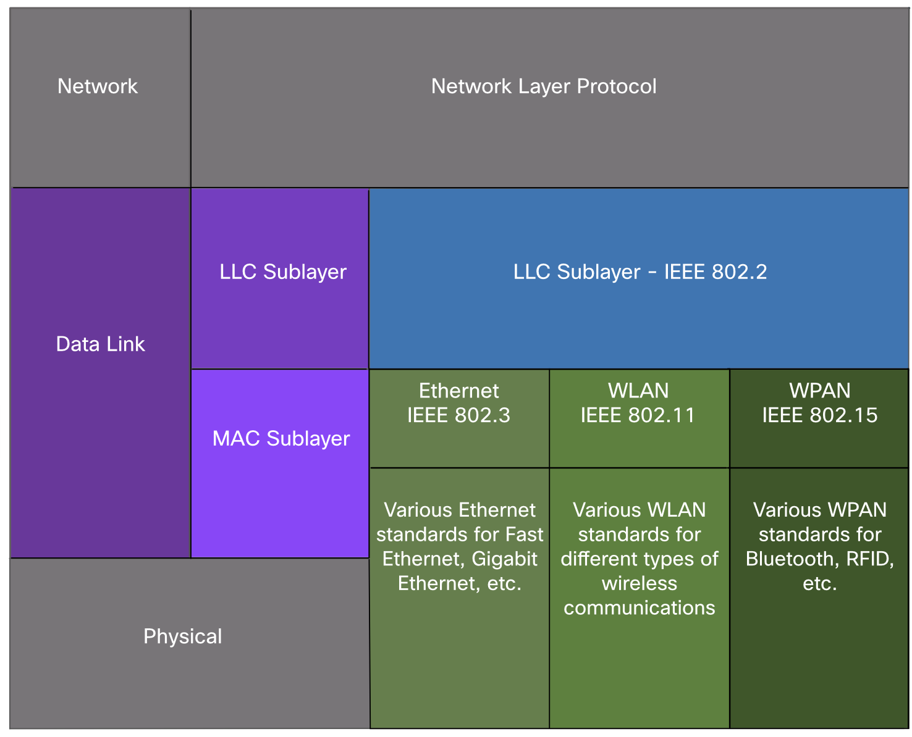
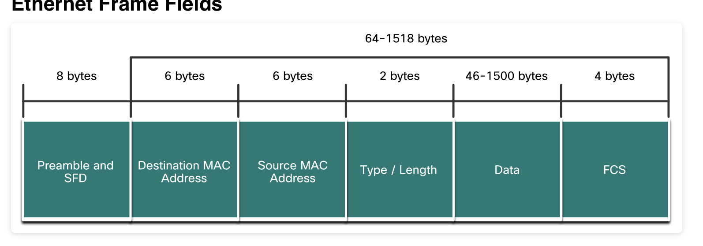
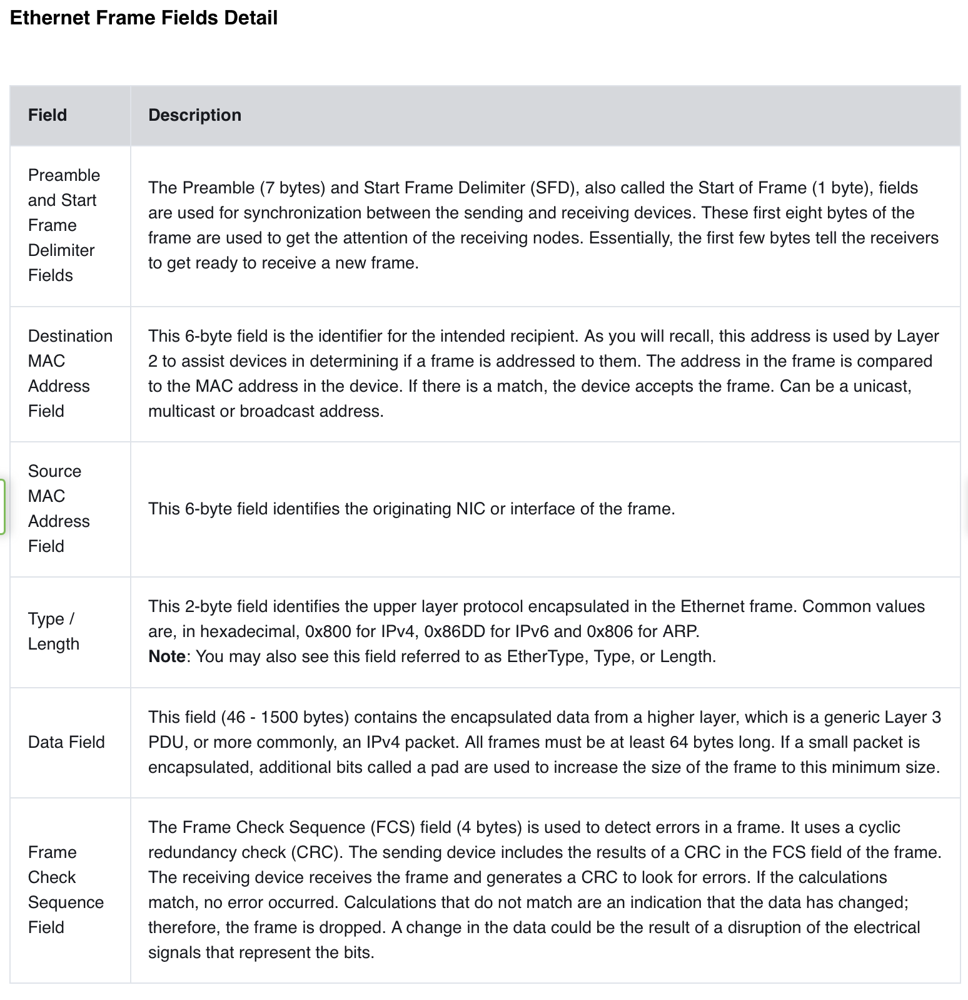

### Ethernet Switching 
Welcome to Ethernet Switching!

If you are planning to become a network administrator or a network architect, you will definitely need to know about Ethernet

and Ethernet switching. The two most prominent LAN technologies in use today are Ethernet and WLAN. Ethernet supports

bandwidths of up to 100 Gbps, which explains its popularity. This module contains a lab using Wireshark in which you can look

at Ethernet frames and another lab where you view network device MAC addresses. There are also some instructional videos

to help you better understand Ethernet. By the time you have finished this module, you too could create a switched network
that uses Ethernet!

### 7.1. Ethernet Frames
This module starts with a discussion of Ethernet technology including an explanation of MAC sublayer and the Ethernet frame fields.
Ethernet is one of two LAN technologies used today, with the other being wireless LANs (WLANs). Ethernet uses wired communications, including twisted pair, fiber-optic links, and coaxial cables.
Ethernet operates in the data link layer and the physical layer. It is a family of networking technologies defined in the lEEE 802.2 and 802.3 standards. Ethernet supports data bandwidths of the following:
• 10 Mbps
• 100 Mbps
• 1000 Mbps (1 Gbps)
• 10,000 Mbps (10 Gbps)
• 40,000 Mbps (40 Gbps)
• 100,000 Mbps (100 Gbps)
As shown in the figure, Ethernet standards define both the Layer 2 protocols and the Layer 1 technologies.

IEEE 802 LAN/MAN protocols, including Ethernet, use the following two separate sublayers of the data link layer to operate.
They are the Logical Link Control (LLC) and the Media Access Control (MAC), as shown in the figure.
Recall that LLC and MAC have the following roles in the data link layer:
• LLC Sublayer - This IEEE 802.2 sublayer communicates between the networking software at the upper layers and the device hardware at the lower layers. It places information in the frame that identifies which network layer protocol is being used for the frame. This information allows multiple Layer 3 protocols, such as IPv4 and IPv6, to use the same network interface and media.
• MAC Sublayer - This sublayer (IEEE 802.3, 802.11, or 802.15 for example) is implemented in hardware and is responsible for data encapsulation and media access control. It provides data link layer addressing and is integrated with various physical layer technologies.

Recall that legacy Ethernet using a bus topology or hubs, is a shared, half-duplex medium. Ethernet over a half-duplex medium uses a contention-based access method, carrier sense multiple access/collision detection (CSMA/CD) This ensures that only one device is transmitting at a time. CSMA/CD allows multiple devices to share the same half-duplex medium, detecting a collision when more than one device attempts to transmit simultaneously. It also provides a back-off algorithm for retransmission.
Ethernet LANs of today use switches that operate in full-duplex. Full-duplex communications with Ethernet switches do not require access control through CSMA/CD.

The minimum Ethernet frame size is 64 bytes and the expected maximum is 1518 bytes. This includes all bytes from the destination MAC address field through the frame check sequence (FCS) field. The preamble field is not included when describing the size of the frame.
Note: The frame size may be larger if additional requirements are included, such as VLAN tagging. VLAN tagging is beyond the scope of this course.
Any frame less than 64 bytes in length is considered a "collision fragment" or "runt frame" and is automatically discarded by receiving stations. Frames with more than 1500 bytes of data are considered "jumbo" or "baby giant frames".
If the size of a transmitted frame is less than the minimum, or greater than the maximum, the receiving device drops the frame.
Dropped frames are likely to be the result of collisions or other unwanted signals. They are considered invalid. Jumbo frames are usually supported by most Fast Ethernet and Gigabit Ethernet switches and NICs.
The figure shows each field in the Ethernet frame. Refer to the table for more information about the function of each field.

### 7.2. Ethernet MAC Address
In networking, IPv4 addresses are represented using the decimal base ten number system and the binary base 2 number system. IPv6 addresses and Ethernet addresses are represented using the hexadecimal base sixteen number system. To understand hexadecimal, you must first be very familiar with binary and decimal.
The hexadecimal numbering system uses the numbers 0 to 9 and the letters A to F.
An Ethernet MAC address consists of a 48-bit binary value. Hexadecimal is used to identify an Ethernet address because a single hexadecimal digit represents four binary bits. Therefore, a 48-bit Ethernet MAC address can be expressed using only
12 hexadecimal values.
The figure compares the equivalent decimal and hexadecimal values for binary 0000 to 1111.

When using hexadecimal, leading zeroes are always displayed to complete the 8-bit representation. For example, in the table, the binary value 0000 1010 is shown in hexadecimal as OA.
Hexadecimal numbers are often represented by the value preceded by Ox (e.g., 0x73) to distinguish between decimal and hexadecimal values in documentation.
Hexadecimal may also be represented by a subscript 16, or the hex number followed by an H (e.g., 73H).
You may have to convert between decimal and hexadecimal values. If such conversions are required, convert the decimal or hexadecimal value to binary, and then to convert the binary value to either decimal or hexadecimal as appropriate.

n an Ethernet LAN, every network device is connected to the same, shared media. The MAC address is used to identify the physical source and destination devices (NICs) on the local network segment. MAC addressing provides a method for device identification at the data link layer of the OSI model.

An Ethernet MAC address is a 48-bit address expressed using 12 hexadecimal digits, as shown in the figure. Because a byte equals 8 bits, we can also say that a MAC address is 6 bytes in length.

All MAC addresses must be unique to the Ethernet device or Ethernet interface. To ensure this, all vendors that sell Ethernet devices must register with the IEEE to obtain a unique 6 hexadecimal (i.e., 24-bit or 3-byte) code called the organizationally unique identifier (OUI).

When a vendor assigns a MAC address to a device or Ethernet interface, the vendor must do as follows:

Use its assigned OUI as the first 6 hexadecimal digits.
Assign a unique value in the last 6 hexadecimal digits.
Therefore, an Ethernet MAC address consists of a 6 hexadecimal vendor OUI code followed by a 6 hexadecimal vendor-assigned value, as shown in the figure.

For example, assume that Cisco needs to assign a unique MAC address to a new device. The IEEE has assigned Cisco a OUI of 00-60-2F. Cisco would then configure the device with a unique vendor code such as 3A-07-BC. Therefore, the Ethernet MAC address of that device would be 00-60-2F-3A-07-BC.

It is the responsibility of the vendor to ensure that none of its devices be assigned the same MAC address. However, it is possible for duplicate MAC addresses to exist because of mistakes made during manufacturing, mistakes made in some virtual machine implementation methods, or modifications made using one of several software tools. In any case, it will be necessary to modify the MAC address with a new NIC or make modifications via software.

Frame Processing
Sometimes the MAC address is referred to as a burned-in address (BIA) because the address is hard coded into read-only memory (ROM) on the NIC. This means that the address is encoded into the ROM chip permanently.

Note: On modern PC operating systems and NICs, it is possible to change the MAC address in software. This is useful when attempting to gain access to a network that filters based on BIA. Consequently, filtering or controlling traffic based on the MAC address is no longer as secure.

When the computer boots up, the NIC copies its MAC address from ROM into RAM. When a device is forwarding a message to an Ethernet network, the Ethernet header includes these:

Source MAC address - This is the MAC address of the source device NIC.
Destination MAC address - This is the MAC address of the destination device NIC.
Click Play in the animation to view the frame forwarding process.

When a NIC receives an Ethernet frame, it examines the destination MAC address to see if it matches the physical MAC address that is stored in RAM. If there is no match, the device discards the frame. If there is a match, it passes the frame up the OSI layers, where the de-encapsulation process takes place.

Note: Ethernet NICs will also accept frames if the destination MAC address is a broadcast or a multicast group of which the host is a member.

Any device that is the source or destination of an Ethernet frame, will have an Ethernet NIC and therefore, a MAC address. This includes workstations, servers, printers, mobile devices, and routers.

Unicast MAC Address
In Ethernet, different MAC addresses are used for Layer 2 unicast, broadcast, and multicast communications.

A unicast MAC address is the unique address that is used when a frame is sent from a single transmitting device to a single destination device.

Click Play in the animation to view how a unicast frame is processed. In this example the destination MAC address and the destination IP address are both unicast.

In the example shown in the animation, a host with IPv4 address 192.168.1.5 (source) requests a web page from the server at IPv4 unicast address 192.168.1.200. For a unicast packet to be sent and received, a destination IP address must be in the IP packet header. A corresponding destination MAC address must also be present in the Ethernet frame header. The IP address and MAC address combine to deliver data to one specific destination host.

The process that a source host uses to determine the destination MAC address associated with an IPv4 address is known as Address Resolution Protocol (ARP). The process that a source host uses to determine the destination MAC address associated with an IPv6 address is known as Neighbor Discovery (ND).

Note: The source MAC address must always be a unicast.

Broadcast MAC Address
An Ethernet broadcast frame is received and processed by every device on the Ethernet LAN. The features of an Ethernet broadcast are as follows:

It has a destination MAC address of FF-FF-FF-FF-FF-FF in hexadecimal (48 ones in binary).
It is flooded out all Ethernet switch ports except the incoming port.
It is not forwarded by a router.
If the encapsulated data is an IPv4 broadcast packet, this means the packet contains a destination IPv4 address that has all ones (1s) in the host portion. This numbering in the address means that all hosts on that local network (broadcast domain) will receive and process the packet.

Click Play in the animation to view how a broadcast frame is processed. In this example the destination MAC address and destination IP address are both broadcasts.

As shown in the animation, the source host sends an IPv4 broadcast packet to all devices on its network. The IPv4 destination address is a broadcast address, 192.168.1.255. When the IPv4 broadcast packet is encapsulated in the Ethernet frame, the destination MAC address is the broadcast MAC address of FF-FF-FF-FF-FF-FF in hexadecimal (48 ones in binary).

DHCP for IPv4 is an example of a protocol that uses Ethernet and IPv4 broadcast addresses.

However, not all Ethernet broadcasts carry an IPv4 broadcast packet. For example, ARP Requests do not use IPv4, but the ARP message is sent as an Ethernet broadcast.

Multicast MAC Address
An Ethernet multicast frame is received and processed by a group of devices on the Ethernet LAN that belong to the same multicast group. The features of an Ethernet multicast are as follows:

There is a destination MAC address of 01-00-5E when the encapsulated data is an IPv4 multicast packet and a destination MAC address of 33-33 when the encapsulated data is an IPv6 multicast packet.
There are other reserved multicast destination MAC addresses for when the encapsulated data is not IP, such as Spanning Tree Protocol (STP) and Link Layer Discovery Protocol (LLDP).
It is flooded out all Ethernet switch ports except the incoming port, unless the switch is configured for multicast snooping.
It is not forwarded by a router, unless the router is configured to route multicast packets.
If the encapsulated data is an IP multicast packet, the devices that belong to a multicast group are assigned a multicast group IP address. The range of IPv4 multicast addresses is 224.0.0.0 to 239.255.255.255. The range of IPv6 multicast addresses begins with ff00::/8. Because multicast addresses represent a group of addresses (sometimes called a host group), they can only be used as the destination of a packet. The source will always be a unicast address.

As with the unicast and broadcast addresses, the multicast IP address requires a corresponding multicast MAC address to deliver frames on a local network. The multicast MAC address is associated with, and uses addressing information from, the IPv4 or IPv6 multicast address.

Click Play in the animation to view how a multicast frame is processed. In this example, the destination MAC address and destination IP address are both multicasts.

Routing protocols and other network protocols use multicast addressing. Applications such as video and imaging software may also use multicast addressing, although multicast applications are not as common.

### 7.3. The MAC Address Table
Switch Fundamentals
Now that you know all about Ethernet MAC addresses, it is time to talk about how a switch uses these addresses to forward (or discard) frames to other devices on a network. If a switch just forwarded every frame it received out all ports, your network would be so congested that it would probably come to a complete halt.

A Layer 2 Ethernet switch uses Layer 2 MAC addresses to make forwarding decisions. It is completely unaware of the data (protocol) being carried in the data portion of the frame, such as an IPv4 packet, an ARP message, or an IPv6 ND packet. The switch makes its forwarding decisions based solely on the Layer 2 Ethernet MAC addresses.

An Ethernet switch examines its MAC address table to make a forwarding decision for each frame, unlike legacy Ethernet hubs that repeat bits out all ports except the incoming port. In the figure, the four-port switch was just powered on. The table shows the MAC Address Table which has not yet learned the MAC addresses for the four attached PCs.

Note: MAC addresses are shortened throughout this topic for demonstration purposes.
Note: The MAC address table is sometimes referred to as a content addressable memory (CAM) table. While the term CAM table is fairly common, for the purposes of this course, we will refer to it as a MAC address table.

Switch Learning and Forwarding
The switch dynamically builds the MAC address table by examining the source MAC address of the frames received on a port. The switch forwards frames by searching for a match between the destination MAC address in the frame and an entry in the MAC address table.

Examine the Source MAC Address

Every frame that enters a switch is checked for new information to learn. It does this by examining the source MAC address of the frame and the port number where the frame entered the switch. If the source MAC address does not exist, it is added to the table along with the incoming port number. If the source MAC address does exist, the switch updates the refresh timer for that entry in the table. By default, most Ethernet switches keep an entry in the table for 5 minutes.

In the figure for example, PC-A is sending an Ethernet frame to PC-D. The table shows the switch adds the MAC address for PC-A to the MAC Address Table.

Note: If the source MAC address does exist in the table but on a different port, the switch treats this as a new entry. The entry is replaced using the same MAC address but with the more current port number.

Find the Destination MAC Address

If the destination MAC address is a unicast address, the switch will look for a match between the destination MAC address of the frame and an entry in its MAC address table. If the destination MAC address is in the table, it will forward the frame out the specified port. If the destination MAC address is not in the table, the switch will forward the frame out all ports except the incoming port. This is called an unknown unicast.

As shown in the figure, the switch does not have the destination MAC address in its table for PC-D, so it sends the frame out all ports except port 1.

Note: If the destination MAC address is a broadcast or a multicast, the frame is also flooded out all ports except the incoming port.

Filtering Frames
As a switch receives frames from different devices, it is able to populate its MAC address table by examining the source MAC address of every frame. When the MAC address table of the switch contains the destination MAC address, it is able to filter the frame and forward out a single port.

### 7.4. Switch Speeds and Forwarding Methods

As you learned in the previous topic, switches use their MAC address tables to determine which port to use to forward frames. With Cisco switches, there are actually two frame forwarding methods and there are good reasons to use one instead of the other, depending on the situation.
Switches use one of the following forwarding methods for switching data between network ports:
• Store-and-forward switching - This frame forwarding method receives the entire frame and computes the CRC.
CRC uses a mathematical formula, based on the number of bits (1s) in the frame, to determine whether the received frame has an error. If the CRC is valid, the switch looks up the destination address, which determines the outgoing interface. Then the frame is forwarded out of the correct port.
• Cut-through switching - This frame forwarding method forwards the frame before it is entirely received. At a minimum, the destination address of the frame must be read before the frame can be forwarded.
A big advantage of store-and-forward switching is that it determines if a frame has errors before propagating the frame.
When an error is detected in a frame, the switch discards the frame. Discarding frames with errors reduces the amount of bandwidth consumed by corrupt data. Store-and-forward switching is required for quality of service (QoS) analysis on converged networks where frame classification for traffic prioritization is necessary. For example, voice over IP (VolP) data streams need to have priority over web-browsing traffic.
Click Play in the animation for a demonstration of the store-and-forward process.

In cut-through switching, the switch acts upon the data as soon as it is received, even if the transmission is not complete. The switch buffers just enough of the frame to read the destination MAC address so that it can determine to which port it should forward out the data. The destination MAC address is located in the first 6 bytes of the frame following the preamble. The switch looks up the destination MAC address in its switching table, determines the outgoing interface port, and forwards the frame onto its destination through the designated switch port. The switch does not perform any error checking on the frame.
Click Play in the animation for a demonstration of the cut-through switching process.

There are two variants of cut-through switching:
• Fast-forward switching - Fast-forward switching offers the lowest level of latency. Fast-forward switching immediately forwards a packet after reading the destination address. Because fast-forward switching starts forwarding before the entire packet has been received, there may be times when packets are relayed with errors.
This occurs infrequently, and the destination NIC discards the faulty packet upon receipt. In fast-forward mode, latency is measured from the first bit received to the first bit transmitted. Fast-forward switching is the typical cut-through method of switching.
• Fragment-free switching - In fragment-free switching, the switch stores the first 64 bytes of the frame before forwarding. Fragment-free switching can be viewed as a compromise between store-and-forward switching and fast-forward switching. The reason fragment-free switching stores only the first 64 bytes of the frame is that most network errors and collisions occur during the first 64 bytes. Fragment-free switching tries to enhance fast-forward switching by performing a small error check on the first 64 bytes of the frame to ensure that a collision has not occurred before forwarding the frame. Fragment-free switching is a compromise between the high latency and high integrity of store-and-forward switching, and the low latency and reduced integrity of fast-forward switching.
Some switches are configured to perform cut-through switching on a per-port basis until a user-defined error threshold is reached. and then they automatically change to store-and-forward. When the error rate falls below the threshold, the port automatically changes back to cut-through switching

An Ethernet switch may use a buffering technique to store frames before forwarding them. Buffering may also be used when the destination port is busy because of congestion. The switch stores the frame until it can be transmitted.
As shown in the table, there are two methods of memory buffering:
Memory Buffering Methods

Port-based memory
Frames are stored in queues that are linked to specific incoming and outgoing ports.
• A frame is transmitted to the outgoing port only when all the frames ahead in the queue have been successfully transmitted.
• It is possible for a single frame to delay the transmission of all the frames in memory because of a busy destination port.
• This delay occurs even if the other frames could be transmitted to open destination ports.

Shared memory
Deposits all frames into a common memory buffer shared by all switch ports and the amount of buffer memory required by a port is dynamically allocated.
• The frames in the buffer are dynamically linked to the destination port enabling a packet to be received on one port and then transmitted on another port, without moving it to a different queue.

Shared memory buffering also results in the ability to store larger frames with potentially fewer dropped frames. This is important with asymmetric switching which allows for different data rates on different ports such as when connecting a server to a 10 Gbps switch port and PCs to 1 Gbps ports.

Two of the most basic settings on a switch are the bandwidth (sometimes referred to as "speed") and duplex settings for each individual switch port. It is critical that the duplex and bandwidth settings match between the switch port and the connected devices, such as a computer or another switch.
There are two types of duplex settings used for communications on an Ethernet network:
• Full-duplex - Both ends of the connection can send and receive simultaneously.
• Half-duplex - Only one end of the connection can send at a time.
Autonegotiation is an optional function found on most Ethernet switches and NICs. It enables two devices to automatically negotiate the best speed and duplex capabilities. Full-duplex is chosen if both devices have the capability along with their highest common bandwidth.
In the figure, the Ethernet NIC for PC-A can operate in full-duplex or half-duplex, and in 10 Mbps or 100 Mbps.

Note: Most Cisco switches and Ethernet NICs default to autonegotiation for speed and duplex. Gigabit Ethernet ports only operate in full-duplex.
Duplex mismatch is one of the most common causes of performance issues on 10/100 Mops Ethernet links. It occurs when one port on the link operates at half-duplex while the other port operates at full-duplex

Duplex mismatch occurs when one or both ports on a link are reset, and the autonegotiation process does not result in both link partners having the same configuration. It also can occur when users reconfigure one side of a link and forget to reconfigure the other. Both sides of a link should have autonegotiation on, or both sides should have it off. Best practice is to configure both Ethernet switch ports as full-duplex.

Connections between devices once required the use of either a crossover or straight-through cable. The type of cable required depended on the type of interconnecting devices.
For example, the figure identifies the correct cable type required to interconnect switch-to-switch, switch-to-router, switch-to-host, or router-to-host devices. A crossover cable is used when connecting like devices, and a straight-through cable is used for connecting unlike devices.
Note: A direct connection between a router and a host requires a cross-over connection.

Most switch devices now support the automatic medium-dependent interface crossover (auto-MDIX) feature. When

enabled, the switch automatically detects the type of cable attached to the port and configures the interfaces

accordingly. Therefore, you can use either a crossover or a straight-through cable for connections to a copper

10/100/1000 port on the switch, regardless of the type of device on the other end of the connection.

The auto-MDIX feature is enabled by default on switches running Cisco IOS Release 12.2(18)SE or later. However, the

feature could be disabled. For this reason, you should always use the correct cable type and not rely on the auto-MDIX

feature. Auto-MDIX can be re-enabled using the mdix auto interface configuration command.

